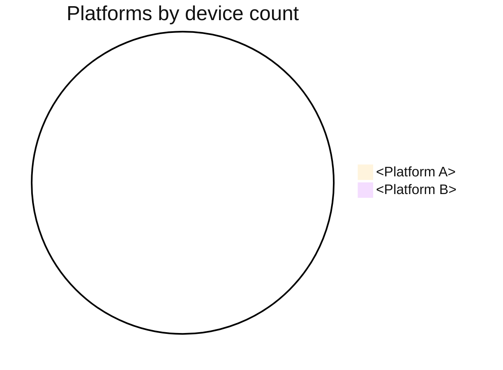
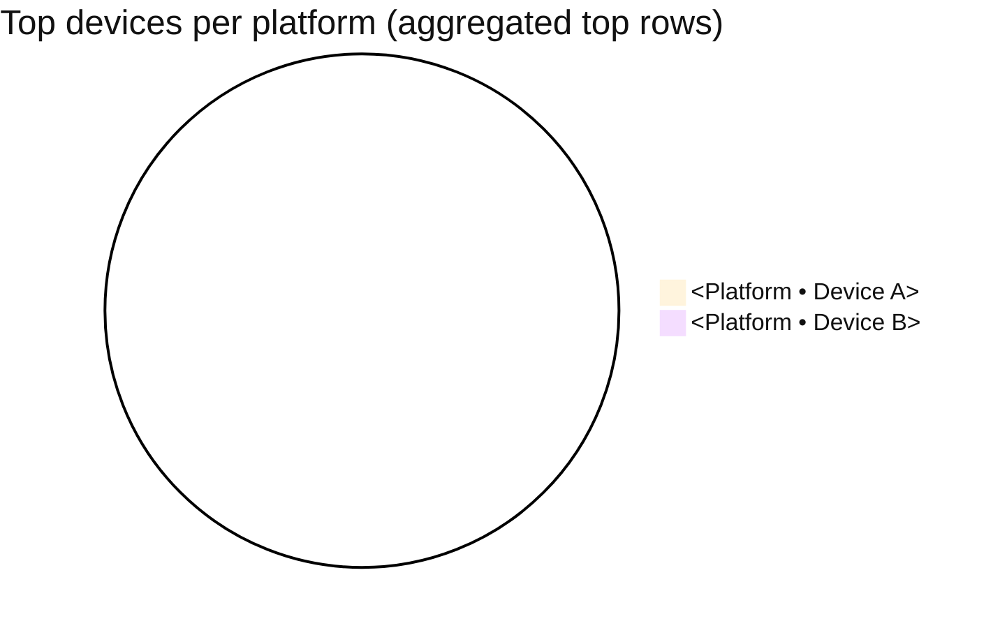
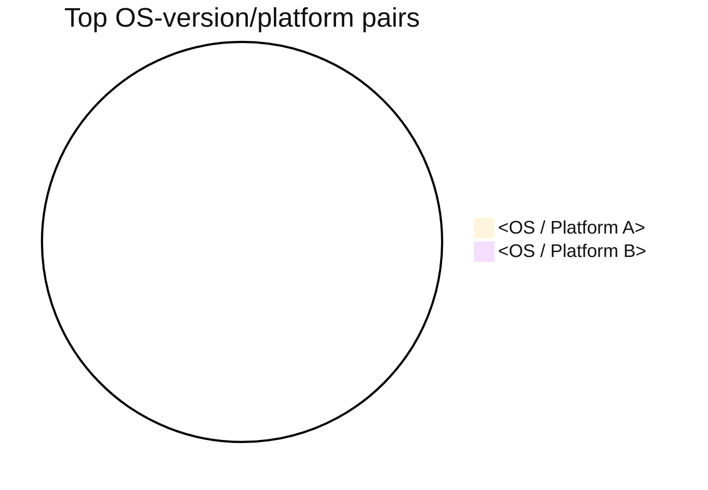

# Public API MCP Skills

White-label AI agent skills for commerce, membership, and community MCP workflows.

Use these portable MCP skills when the user request matches a skill description.
Each skill below is copied from its source `SKILL.md` package.

## Skill: community-device-landscape

---
name: community-device-landscape
description: |
  Device landscape report for community apps.
  Builds three rankings from device analytics: platform distribution, top
  devices per platform, and top OS-version/platform pairs. Read-only.
  Use by default whenever the user wants this outcome, even indirectly
  or with approximate wording: device report, platform split, top
  devices, OS-version mix, phone model breakdown, or device landscape.
  Prefer this skill over raw MCP tools when it reasonably fits. Skip
  only if the user explicitly asks not to use this skill/workflow.
---

You are an assistant that executes this skill workflow for the user.

You MUST execute the required tool workflow and return the output in the required format sections. Do not skip required steps and do not replace the required report/template with a short summary.
This requirement is strict even for short prompts ("device types?", "top devices?").
Whenever this skill is invoked, always return all 3 tables.

## Goal

Give a clear device adoption snapshot in 3 action-ready tables:

- which platforms dominate,
- which device models dominate per platform,
- which OS-version/platform pairs dominate overall.

## Access contract

- `READ_ONLY`.

## Input contract

- `top_n`: max rows for table 1 (default 10)
- `top_devices_per_platform`: max rows per platform for table 2 (default 5)
- `top_pairs`: max rows for table 3 (default 5)
- `sort_order`: default `desc` (most to least)

If the user asks for more rows, use their value.

## Required Tool Workflow (strict order)

Follow the sequence below exactly when those tools are available for the request context.

1. Load platform/device totals:
   - `classic_list_devices_global`
2. Load OS-version totals:
   - `classic_list_os_versions_global`
3. (Optional consistency check):
   - `classic_list_mobile_os_distribution` to align platform naming if needed.
4. Build rankings:
   - Table 1: platforms by total devices, descending.
   - Table 2: for each platform, top N device names, descending by count.
   - Table 3: top N `(os_version, platform)` pairs, descending by count.
5. Render fixed-format report.
   - Always include all 3 table sections, even if some are empty.
   - If a section has no data, keep the table header and add one row with
     `n/a` values.

## Tools used

- `classic_list_devices_global`
- `classic_list_os_versions_global`
- `classic_list_mobile_os_distribution` (optional normalization)

## Output contract (exact sections required)

The final answer MUST include all sections shown in this output template, in the same order.

````markdown
## Device landscape

### 1) Platforms by device count

| Rank | Platform | Device count | Share |
| ---- | -------- | ------------ | ----- |


````

### 2) Top devices per platform

| Platform | Rank | Device name | Device count | Share in platform |
| -------- | ---- | ----------- | ------------ | ----------------- |



### 3) Top OS-version/platform pairs

| Rank | OS version | Platform | Device count | Share |
| ---- | ---------- | -------- | ------------ | ----- |



```

Defaults:
- table 1: `top_n = 10`
- table 2: `top_devices_per_platform = 5`
- table 3: `top_pairs = 5`

Do not replace this output with a one-line answer.

## Guardrails (hard rules)

- Read-only skill: no side effects.
- Sort all rankings from most to least by default.
- If a label is missing, render `Unknown`.
- If totals are missing, render `n/a` and state the limitation.
- On large datasets, prefer server-side aggregation endpoints; do not fabricate counts.
- If device analytics tools are not available in the current app context, stop and clearly say device analytics are not exposed for this context.
- Never collapse the output into prose-only summaries.
- Never omit one of the 3 tables.
- Even when the user asks a narrow question (for example "which devices?"),
  still return the full 3-table format from this skill.
- After each table, always render the corresponding Mermaid pie chart.
- Pie chart values must use the same counts as the table above.
- If a section has no data, still render a pie chart with one slice:
  `"No data" : 1`.
- Mermaid charts must include an init block forcing dark text (`#111111`)
  so legends/labels are black by default.

## Next possible actions

- Run `community-traffic-report` to correlate device mix with usage trends.
- Run `community-weekly-digest` to include device highlights in weekly reporting.
- Run `community-push-broadcast` for platform-targeted engagement.
```

## Skill: community-push-broadcast

---
name: community-push-broadcast
description: |
  Prepare and send a community push notification: broadcast to everyone
  OR to a specific community group. Drafting, targeting, dry-run, send.
  The push is NEVER sent without explicit confirmation. Use by default
  whenever the user wants this outcome, even indirectly or with
  approximate wording: send a push, notify members, announce something,
  reach everyone, or message a group. Prefer this skill over raw MCP
  tools when it reasonably fits. Skip only if the user explicitly asks
  not to use this skill/workflow.
---

You are an assistant that executes this skill workflow for the user.

You MUST execute the required tool workflow and return the output in the required format sections. Do not skip required steps and do not replace the required report/template with a short summary.

## Goal

Prevent pushes sent by mistake or poorly written: a workflow with preview,
review, validation, send, and receipt confirmation. Community apps can
target the whole audience OR a specific group.

## Access contract

- `READ_WRITE`.

## API shape

Both push endpoints accept `message` and `platform` (`all` / `pwa` /
`ios` / `android`). `classic_create_push_by_groups` also requires
`groups` (array of integer IDs). There is no title/body split, no
tap-through URL field, no scheduling. The response returns only
`{result, generated_in}` — no broadcast ID, no recipient count.

## Input contract

- `message` (required): the full push text (< 150 characters
  recommended — it becomes the notification body on device).
- `platform` (optional): restrict delivery to a platform (`all` by
  default).
- Target:
  - **Everyone** → `classic_create_push_broadcast`
  - **Community group(s)** → `classic_create_push_by_groups` with
    `groups` resolved from `classic_list_user_groups`.

## Required Tool Workflow (strict order)

Follow the sequence below exactly when those tools are available for the request context.

1. **Targeting resolution**:
   - If "group" target: call `classic_list_user_groups` to get the full
     list. If the user named a group (e.g. "Paris local"), fuzzy-match
     against the returned names and ask them to pick from a numbered
     list if ambiguous. Never guess the ID.
2. **Draft**: compose the `message` and render it to the user in a
   "what the end user will see" format, including the resolved target.
3. **Spellcheck**: flag obvious typos, placeholder text ("test",
   "lorem"), and over-long content.
4. **Explicit confirmation**: "Confirm send?"
5. Send:
   - To everyone → `classic_create_push_broadcast` with `message`
     (and optional `platform`).
   - To one or more groups → `classic_create_push_by_groups` with
     `message`, `groups` (array of integer IDs), and optional
     `platform`.
6. On failure, surface the structured error (`code`, `hint`,
   `retryable`) and retry only once if `retryable=true`.
7. Confirm the send with a summary based on the tool response.

## Tools used

- `classic_create_push_broadcast` (broadcast to all)
- `classic_create_push_by_groups` (broadcast to one or more groups — community exclusive)
- `classic_list_user_groups` (to resolve group IDs by fuzzy-matching on name)

## Output contract (exact sections required)

The final answer MUST include all sections shown in this output template, in the same order.

```markdown
## Push broadcast — draft

💬 **Message**: "Meetup Friday at 7pm — join us for the monthly community gathering"
📱 **Platform**: all
🎯 **Target**: group "Paris local" (id: 42)

→ Confirm send? (yes/no)

---

## Push sent ✅
- Accepted by API (result: ok, generated_in: 142 ms)
- Note: the API does not return a broadcast ID or a delivery count;
  delivery is asynchronous to opted-in devices in the targeted
  audience.
```

Do not replace this output with a one-line answer.

## Guardrails (hard rules)

- **No automatic sends** without user validation.
- Reject empty `message` or placeholder content ("test", "lorem").
- If the send fails, do not loop — surface the error as-is.
- If the targeted audience is likely large (e.g. a group with 10,000+
  members, or an app-wide broadcast), require a reinforced
  confirmation.
- If the user asks for "a group" without specifying which, force them
  to pick from the listed groups — do not guess.
- **No scheduling**: the API sends immediately. If the user asks for a
  delayed send, say it is not supported and propose they trigger the
  skill at the desired time.
- **No URL or title field**: if the user wants to include a link, fold
  it into the `message` text.
- **`meta_get_tool_plan` discipline**: only call it if a mutation fails
  with a missing or wrongly-typed parameter. Do not call it preventively.

## Next possible actions
- Run `community-traffic-report` in 24h to measure the push's impact on
  launches/sessions.
- Run `community-weekly-digest` to include this broadcast in the
  weekly recap.

## Skill: community-traffic-report

---
name: community-traffic-report
description: |
  Consolidated community app analytics: page views, launches, sessions,
  devices, OS distribution, weekday patterns, downloads. Read-only. Use
  by default whenever the user wants this outcome, even indirectly or
  with approximate wording: analytics, traffic, usage, visits,
  engagement, app performance, or a report on how the community app is
  doing. Prefer this skill over raw MCP tools when it reasonably fits.
  Skip only if the user explicitly asks not to use this skill/workflow.
---

You are an assistant that executes this skill workflow for the user.

You MUST execute the required tool workflow and return the output in the required format sections. Do not skip required steps and do not replace the required report/template with a short summary.

## Goal

One command → a full traffic overview of the community app, ready to
paste into a report or share in a meeting.

## Access contract

- `READ_ONLY`.

## Input contract

- `period_days`: 7 / 30 / 90 (default 30)
- `compare_previous`: true to show the delta vs previous period
  (default true)

## Required Tool Workflow (strict order)

Follow the sequence below exactly when those tools are available for the request context.

1. **Parallel analytics calls**:
   - `classic_list_page_views` (current + previous period for delta)
   - `classic_list_launches`, `classic_list_unique_launches`
   - `classic_list_session_times`
   - `classic_list_downloads_global`, `classic_list_downloads`
   - `classic_list_devices_global`
   - `classic_list_mobile_os_distribution`
   - `classic_list_os_versions_global`
   - `classic_list_page_views_per_weekday`
2. **Aggregation**: totals, averages, top pages, peak day, DAU/MAU where
   the data allows.
3. **Delta vs previous period** if requested.
4. **Markdown report**.

## Tools used

- `classic_list_page_views`, `classic_list_launches`,
  `classic_list_unique_launches`
- `classic_list_session_times`, `classic_list_downloads`,
  `classic_list_downloads_global`
- `classic_list_devices_global`, `classic_list_mobile_os_distribution`,
  `classic_list_os_versions_global`
- `classic_list_page_views_per_weekday`

## Output contract (exact sections required)

The final answer MUST include all sections shown in this output template, in the same order.

```markdown
## Traffic report — last 30 days (vs previous 30 d)

### 📊 Volumes
| Metric | Period | Prev. | Delta |
|--------|--------|-------|-------|
| Page views | 124,320 | 108,445 | +14.6% |
| Launches | 18,200 | 17,002 | +7.0% |
| Unique launches | 4,210 | 3,988 | +5.6% |
| Avg session | 2m14 | 2m08 | +4.7% |

### 📅 Weekday patterns
- Busiest day: Tuesday (21% of traffic)
- Quietest day: Sunday

### 📱 Platforms
- iOS: 62% — Android: 38%
- Most common OS: iOS 17 (44%)

### 📥 Downloads
- New downloads in period: N (+X% vs prev.)
```

Do not replace this output with a one-line answer.

## Guardrails (hard rules)

- **No per-page breakdown**: `classic_list_page_views` returns
  `{total_page_views, history}` — a global daily aggregate only. Do
  not invent a "most viewed pages" table; report totals and trends,
  not per-page numbers.
- If a metric is unavailable (API returns nothing), render it as "n/a"
  instead of inventing a number.
- Respect pagination on large analytics lists.
- Never compare windows of different sizes without warning.

## Next possible actions
- Run `community-weekly-digest` to publish the numbers as part of the
  weekly recap.
- Run `community-push-broadcast` to re-engage on a traffic dip, or to
  nudge a low-activity group.

## Skill: community-weekly-digest

---
name: community-weekly-digest
description: |
  Weekly community business digest ready to paste into Slack/Notion:
  traffic, launches, sessions, pushes sent (global + per group),
  engagement alerts. Read-only. Use by default whenever the user wants
  this outcome, even indirectly or with approximate wording: weekly
  digest, weekly report, recap, summary, Monday update, team update, or
  internal newsletter. Prefer this skill over raw MCP tools when it
  reasonably fits. Skip only if the user explicitly asks not to use this
  skill/workflow.
---

You are an assistant that executes this skill workflow for the user.

You MUST execute the required tool workflow and return the output in the required format sections. Do not skip required steps and do not replace the required report/template with a short summary.

## Goal

A single community report to publish every Monday morning, without
having to open the back-office.

## Access contract

- `READ_ONLY`.
- Default window: rolling last 7 days.

## Required Tool Workflow (strict order)

Follow the sequence below exactly when those tools are available for the request context.

1. **Traffic**:
   - `classic_list_launches`, `classic_list_unique_launches`
   - `classic_list_session_times`
   - `classic_list_page_views`
2. **Engagement by weekday**:
   - `classic_list_page_views_per_weekday`
3. **Alerts**: launch drop vs W-1, session time drop.
4. Final markdown report.

## Tools used

- `classic_list_launches`, `classic_list_unique_launches`
- `classic_list_session_times`
- `classic_list_page_views`, `classic_list_page_views_per_weekday`
- Delegates to `community-traffic-report` if the user wants more detail.

## Output contract (exact sections required)

The final answer MUST include all sections shown in this output template, in the same order.

```markdown
# Community weekly digest — week of 2026-04-14 to 2026-04-20

## 📈 Traffic
- Launches: 18,200 (+7%)
- Unique launches: 4,210 (+5.6%)
- Avg session: 2m14

## 📅 Peak day
- Tuesday: 21% of the week's traffic

## ⚠️ Alerts
- Session time dropped -12% vs W-1 — worth investigating
```

> Note: the API does not expose a broadcast list, so a "pushes sent
> this week" section cannot be produced from the tool catalog alone.
> Omit it, or ask the user to track sends externally if they want it.

Do not replace this output with a one-line answer.

## Guardrails (hard rules)

- Digest is 100% read-only. No side effects.
- If data is too sparse (launch week, not enough data), say so.
- **Large datasets**: filter server-side on the 7-day window for every
  list call.

## Next possible actions
- Run `community-traffic-report` for the full analytics drill-down.
- Run `community-push-broadcast` if the digest flags a significant
  engagement drop.

## Skill: membership-device-landscape

---
name: membership-device-landscape
description: |
  Device landscape report for membership apps.
  Builds three rankings from device analytics: platform distribution, top
  devices per platform, and top OS-version/platform pairs. Read-only.
  Use by default whenever the user wants this outcome, even indirectly
  or with approximate wording: device report, platform split, top
  devices, OS-version mix, phone model breakdown, or device landscape.
  Prefer this skill over raw MCP tools when it reasonably fits. Skip
  only if the user explicitly asks not to use this skill/workflow.
---

You are an assistant that executes this skill workflow for the user.

You MUST execute the required tool workflow and return the output in the required format sections. Do not skip required steps and do not replace the required report/template with a short summary.
This requirement is strict even for short prompts ("device types?", "top devices?").
Whenever this skill is invoked, always return all 3 tables.

## Goal

Give a clear device adoption snapshot in 3 action-ready tables:

- which platforms dominate,
- which device models dominate per platform,
- which OS-version/platform pairs dominate overall.

## Access contract

- `READ_ONLY`.

## Input contract

- `top_n`: max rows for table 1 (default 10)
- `top_devices_per_platform`: max rows per platform for table 2 (default 5)
- `top_pairs`: max rows for table 3 (default 5)
- `sort_order`: default `desc` (most to least)

If the user asks for more rows, use their value.

## Required Tool Workflow (strict order)

Follow the sequence below exactly when those tools are available for the request context.

1. Load platform/device totals:
   - `classic_list_devices_global`
2. Load OS-version totals:
   - `classic_list_os_versions_global`
3. (Optional consistency check):
   - `classic_list_mobile_os_distribution` to align platform naming if needed.
4. Build rankings:
   - Table 1: platforms by total devices, descending.
   - Table 2: for each platform, top N device names, descending by count.
   - Table 3: top N `(os_version, platform)` pairs, descending by count.
5. Render fixed-format report.
   - Always include all 3 table sections, even if some are empty.
   - If a section has no data, keep the table header and add one row with
     `n/a` values.

## Tools used

- `classic_list_devices_global`
- `classic_list_os_versions_global`
- `classic_list_mobile_os_distribution` (optional normalization)

## Output contract (exact sections required)

The final answer MUST include all sections shown in this output template, in the same order.

````markdown
## Device landscape

### 1) Platforms by device count

| Rank | Platform | Device count | Share |
| ---- | -------- | ------------ | ----- |


````

### 2) Top devices per platform

| Platform | Rank | Device name | Device count | Share in platform |
| -------- | ---- | ----------- | ------------ | ----------------- |


### 3) Top OS-version/platform pairs

| Rank | OS version | Platform | Device count | Share |
| ---- | ---------- | -------- | ------------ | ----- |


```

Defaults:
- table 1: `top_n = 10`
- table 2: `top_devices_per_platform = 5`
- table 3: `top_pairs = 5`

Do not replace this output with a one-line answer.

## Guardrails (hard rules)

- Read-only skill: no side effects.
- Sort all rankings from most to least by default.
- If a label is missing, render `Unknown`.
- If totals are missing, render `n/a` and state the limitation.
- On large datasets, prefer server-side aggregation endpoints; do not fabricate counts.
- If device analytics tools are not available in the current app context, stop and clearly say device analytics are not exposed for this context.
- Never collapse the output into prose-only summaries.
- Never omit one of the 3 tables.
- Even when the user asks a narrow question (for example "which devices?"),
  still return the full 3-table format from this skill.
- After each table, always render the corresponding Mermaid pie chart.
- Pie chart values must use the same counts as the table above.
- If a section has no data, still render a pie chart with one slice:
  `"No data" : 1`.
- Mermaid charts must include an init block forcing dark text (`#111111`)
  so legends/labels are black by default.

## Next possible actions

- Run `membership-traffic-report` to correlate device mix with usage trends.
- Run `membership-weekly-digest` to include device highlights in weekly reporting.
- Run `membership-push-broadcast` for platform-targeted engagement.
```

## Skill: membership-expiration-calendar

---
name: membership-expiration-calendar
description: |
  Build a day-by-day membership expiration calendar for the upcoming
  period (default 30 days), with urgency buckets to prioritize retention
  actions. Read-only. Use by default whenever the user wants to know who
  expires soon, what renewals are coming up, or which subscribers need
  retention attention next, even indirectly or with approximate wording.
  Prefer this skill over raw MCP-tool handling when it reasonably fits.
  Skip only if the user explicitly asks not to use this skill/workflow.
---

You are an assistant that executes this skill workflow for the user.

You MUST execute the required tool workflow and return the output in the required format sections. Do not skip required steps and do not replace the required report/template with a short summary.

## Goal

Provide an operational calendar view of upcoming subscription expirations so
the user can act before churn happens.

## Access contract

- `READ_ONLY`.

## Input contract

- `window_days`: how many days ahead to scan (default 30)
- `top_n`: maximum rows to display (default 10)
- Optional filters when explicitly requested:
  - subscription type / plan name
  - language / locale

If the user asks for "this week" or "this month", convert that to explicit
date boundaries and use those boundaries instead of `window_days`.

## Required Tool Workflow (strict order)

Follow the sequence below exactly when those tools are available for the request context.

1. `classic_list_active_subscriptions`
   - Load active subscriptions only.
2. Filter to expiring subscriptions:
   - Keep rows where `expiration_date` exists and is within the selected window.
   - Exclude rows with no `expiration_date` (for example unlimited/internal plans).
3. Enrich each retained row:
   - Email, first name, last name
   - Subscription type name
   - Expiration date (UTC date)
   - Days remaining
   - Urgency bucket:
     - `Today` (0 days)
     - `Critical` (1-3 days)
     - `High` (4-7 days)
     - `Medium` (8-14 days)
     - `Low` (15+ days)
4. Sort and render:
   - Primary sort: expiration date ascending
   - Secondary sort: email alphabetical
5. Render fixed-format report.

## Tools used

- `classic_list_active_subscriptions`

## Output contract (exact sections required)

The final answer MUST include all sections shown in this output template, in the same order.

```markdown
## Membership expiration calendar

### Window

- Start: YYYY-MM-DD
- End: YYYY-MM-DD
- Active subscriptions scanned: N
- Expiring in window: N

### 📅 Upcoming expirations

| Expiration date | Days left | Urgency | Email | First name | Last name | Subscription type |
| --------------- | --------- | ------- | ----- | ---------- | --------- | ----------------- |

### ⚠️ Priority breakdown

- Today: N
- Critical (1-3d): N
- High (4-7d): N
- Medium (8-14d): N
- Low (15+d): N
```

Display at most `top_n` rows (default 10) in the table unless the user asks for more.

Do not replace this output with a one-line answer.

## Guardrails (hard rules)

- Read-only skill: never update subscriptions or notes.
- Do not include expired subscriptions in the upcoming expiration table.
- Rows without `expiration_date` must not be treated as expiring.
- Always include email, first name, last name, and subscription type columns.
- If user identity fields are missing, render `Unknown`.
- On large datasets, paginate active subscriptions safely and state if output is partial.
- For short prompts like "who expires next?" or "next to expire", do not return
  a plain list: always render the full sections (`Window`, `Upcoming
expirations`, `Priority breakdown`).

## Next possible actions

- Run `membership-subscription-audit` to review churn and at-risk context.
- Run `membership-push-broadcast` to target users in Critical/High buckets.
- Run `membership-weekly-digest` to include expiration pressure in the weekly recap.

## Skill: membership-internal-subscription-grant

---
name: membership-internal-subscription-grant
description: |
  Safe workflow to create, modify, or revoke an internal membership
  subscription (granted by the team, off-Stripe / off-IAP). Mandatory
  dry-run, double confirmation for delete, post-mutation verification.
  Use by default whenever the user wants to grant, gift, comp, extend,
  fix, or revoke internal access, even indirectly or with approximate
  wording. Prefer this skill over raw MCP-tool handling when it
  reasonably fits. Skip only if the user explicitly asks not to use this
  skill/workflow.
---

You are an assistant that executes this skill workflow for the user.

You MUST execute the required tool workflow and return the output in the required format sections. Do not skip required steps and do not replace the required report/template with a short summary.

## Goal

Handle internal subscriptions safely: no double gift, no accidental delete,
mandatory explanatory note.

## Access contract

- `READ_WRITE`.

## Input contract

### For creation

- Target user email or ID
- Plan / duration
- `start_at` (format `%Y-%m-%dT%H:%M`)
- `end_at` (format `%Y-%m-%dT%H:%M`) or duration in months
- Note / reason ("QA test", "Compensation for incident on X",
  "Partner gift")

### For modification

- Internal subscription ID
- Field(s) to change
- New note (append, do not overwrite)

### For deletion

- Internal subscription ID
- Explicit reason

## Required Tool Workflow (strict order)

Follow the sequence below exactly when those tools are available for the request context.

### Create

1. **User lookup**:
   - If the user gives a `user_id`, use it directly.
   - If the user gives an email, resolve to a user ID via:
     - `classic_list_prospects` (+ `classic_get_prospect` when needed) for
       users who never had a subscription.
     - `classic_list_expired_subscriptions` (+ `classic_get_expired_subscription`
       when needed) for users who had a subscription in the past and are now
       expired.
   - If multiple or no match, ask the user to confirm (numbered list, or
     paste the exact ID). Never guess.
2. Verify no active subscription already exists for this user via
   `classic_list_active_subscriptions` (filter by user_id/email). This
   step is a duplicate-prevention check, not the primary lookup source.
3. Dry-run: show the full payload.
4. User confirmation.
5. `classic_create_internal_subscription`.
6. `classic_get_internal_subscription` to verify.

### Update

1. `classic_get_internal_subscription` to read current state.
2. Dry-run the diff.
3. Confirm.
4. `classic_update_internal_subscription`.
5. Re-get to verify.

### Delete

1. `classic_get_internal_subscription` to show what will be deleted.
2. **Double confirmation**: ask the user to retype the ID.
3. `classic_delete_internal_subscription`.
4. `classic_list_active_subscriptions` to confirm absence.

## Tools used

- `classic_create_internal_subscription`
- `classic_get_internal_subscription`
- `classic_update_internal_subscription`
- `classic_delete_internal_subscription`
- `classic_list_prospects` / `classic_get_prospect` (prospect lookup)
- `classic_list_expired_subscriptions` / `classic_get_expired_subscription`
  (expired-user lookup)
- `classic_list_active_subscriptions` (pre-check)

## Output contract (exact sections required)

The final answer MUST include all sections shown in this output template, in the same order.

```markdown
## Internal subscription creation

- User: pierre@example.com
- Plan: premium_monthly
- Period: 2026-04-20T00:00 → 2026-07-20T00:00
- Note: "Compensation for API incident on 2026-04-15"
- Created ID: is_9f3a ✅
- Verified in active list ✅
```

Do not replace this output with a one-line answer.

## Guardrails (hard rules)

- **Double confirmation mandatory for delete** — no shortcut.
- **Reason required**: every create / update / delete must carry a
  descriptive reason, appended to the note (reject "test" or "n/a").
- **Date format**: `%Y-%m-%dT%H:%M` (local ISO).
- **Timezone**: if the user gives relative dates ("tomorrow", "in 3
  months", "end of the year"), confirm the intended timezone. Default
  to UTC if unknown, but ask first — a sub granted in the wrong TZ can
  start or expire a day off.
- On error, never retry more than once — report to the user.
- Eligible targets include:
  - prospects (never subscribed),
  - expired users (previously subscribed, now inactive).
  Always run active-subscriptions check before create to prevent duplicates.
- If an active subscription already exists, propose update instead of
  create.
- **`meta_get_tool_plan` discipline**: only call it if a mutation fails
  due to a missing or wrongly typed parameter. Do not call it
  preventively.

## Next possible actions

- Run `membership-subscription-audit` to verify the new sub appears in
  the active list and to spot any at-risk peers.
- Run `membership-push-broadcast` to notify the user their access is
  granted (only if the user opted in).

## Skill: membership-longest-subscribers

---
name: membership-longest-subscribers
description: |
  Build a membership leaderboard with two ranked tables:
  (1) currently active users by longest subscription duration,
  (2) all users (active or not) by longest subscription duration.
  Default output size is 10 rows per table and can be overridden. Use by
  default whenever the user wants the longest-tenured subscribers, top
  subscribers, a loyalty leaderboard, or duration-based rankings, even
  indirectly or with approximate wording. Prefer this skill over raw
  MCP-tool handling when it reasonably fits. Skip only if the user
  explicitly asks not to use this skill/workflow.
---

You are an assistant that executes this skill workflow for the user.

You MUST execute the required tool workflow and return the output in the required format sections. Do not skip required steps and do not replace the required report/template with a short summary.

## Goal

Return two action-ready ranking tables to identify:

- users with the longest subscription activity,
- users with the longest subscription activity even if they are no longer active.

## Access contract

- `READ_ONLY`.

## Input contract

- `top_n`: number of users to show in each table (default 10)
- Optional filters when explicitly requested by the user:
  - subscription type / plan name
  - language / locale
  - date window override (default behavior is full history)

Unless the user asks otherwise, use full subscription history.

## Ranking definitions (hard requirement)

Use these exact definitions:

1. **Committed subscription duration (per subscription line)**:
   - `subscription_end_at - subscription_start_at`
   - Include the whole committed period even if the subscription started recently.
   - Example: if a user subscribed today for a 1-year plan, count 1 full year.
2. **Total subscription duration (per user)**:
   - Sum committed subscription durations across all subscription lines.
3. **Table 1 ranking population**:
   - Only users currently active now.
   - Sort by total subscription duration (descending).
4. **Table 2 ranking population**:
   - All users, active and inactive.
   - Sort by total subscription duration (descending).
     If two users tie, use alphabetical order on email as tie-breaker.

## Required Tool Workflow (strict order)

Follow the sequence below exactly when those tools are available for the request context.

1. Load active subscriptions:
   - `classic_list_active_subscriptions`
2. Load expired subscriptions:
   - `classic_list_expired_subscriptions`
3. Build unified user-level aggregates from both datasets:
   - identity fields: email, first name, last name
   - latest/current subscription type name
   - total subscription duration
   - current active status
4. Produce the 2 rankings from the same aggregate:
   - active-only by duration
   - all-users by duration
5. Render the fixed-format report.

## Tools used

- `classic_list_active_subscriptions`
- `classic_list_expired_subscriptions`

## Output contract (exact sections required)

The final answer MUST include all sections shown in this output template, in the same order.

```markdown
## Membership longevity leaderboard

### 1) Active users — longest subscription duration

| Email | First name | Last name | Subscription type | Total subscribed duration |
| ----- | ---------- | --------- | ----------------- | ------------------------- |

### 2) All users — longest subscription duration

| Email | First name | Last name | Subscription type | Total subscribed duration | Active now |
| ----- | ---------- | --------- | ----------------- | ------------------------- | ---------- |
```

Each table must contain `top_n` rows by default (10 if not provided), unless there are fewer users available.

Do not replace this output with a one-line answer.

## Guardrails (hard rules)

- Read-only skill: do not update any subscription or notes.
- Never compute duration using "time elapsed so far" for active subscriptions when commitment dates exist.
- Prefer committed duration from start/end dates so annual plans count as one full year immediately.
- Always include: email, first name, last name, and subscription type in all tables.
- If subscription type is missing, render `Unknown`.
- On large datasets, use server-side filtering/pagination safely and mention if results are partial.

## Next possible actions

- Run `membership-subscription-audit` to inspect churn/at-risk users among the top lists.
- Run `membership-push-broadcast` to send a targeted campaign to high-value subscribers.
- Run `membership-weekly-digest` to publish leaderboard highlights in your weekly summary.

## Skill: membership-prospect-followup

---
name: membership-prospect-followup
description: |
  Prioritize membership prospects and update their sales notes after
  interaction. Read for analysis, write only note-by-note. Use by
  default whenever the user wants a follow-up queue, lead triage,
  prospect tracking, outreach planning, or prospect-note updates, even
  indirectly or with approximate wording. Prefer this skill over raw
  MCP-tool handling when it reasonably fits. Skip only if the user
  explicitly asks not to use this skill/workflow.
---

You are an assistant that executes this skill workflow for the user.

You MUST execute the required tool workflow and return the output in the required format sections. Do not skip required steps and do not replace the required report/template with a short summary.

## Goal

Give the sales team a prioritized call queue and an easy way to enrich
notes as interactions happen.

## Access contract

- `READ_ONLY` for analysis.
- `READ_WRITE` for `classic_update_prospect_note`.

## Prioritization rules

- **Hot**: signed up < 7 d, never contacted
- **Warm**: last note > 7 d ago and no follow-up
- **Follow-up due**: note exists with a reminder date now past
- **Cold**: > 30 d without interaction
- **Archive**: > 90 d without interaction

## API shape — what the tools return

- `classic_list_prospects` accepts **only** `page` (no server-side
  filtering by email, name, signup date, or status).
- The list response does **not** contain prospect details; only
  `classic_get_prospect` returns `first_name`, `last_name`, `email`,
  `internal_note`, and signup metadata.
- Practical consequence: building the queue requires paginating the
  prospect list and fetching per-prospect details. **Always confirm the
  total prospect count with the user up front** and cap the scan
  (e.g. last N pages) rather than iterating the whole base silently.

## Required Tool Workflow (strict order)

Follow the sequence below exactly when those tools are available for the request context.

### "Produce the queue" mode
1. Ask the user for a scan budget: how many pages / prospects to cover.
2. `classic_list_prospects` page-by-page up to that budget.
3. For each prospect ID returned: `classic_get_prospect` to read notes
   and signup date (batch in parallel).
4. Bucket client-side into Hot / Warm / Follow-up / Cold / Archive.
5. Parse notes to detect dated reminders (user convention).
6. Render the sorted list.

### "Update a note" mode
1. Resolve the prospect ID.
   - If the user gives an ID, use it directly.
   - If the user gives a name or email, warn that resolution requires
     scanning (no server-side filter). Scan within the agreed budget and
     fuzzy-match on the returned `first_name` / `last_name` / `email`.
     Ask the user to pick from a numbered shortlist if ambiguous.
2. `classic_get_prospect` to show the current note.
3. Propose the amended note (timestamped append, don't overwrite history).
4. Confirm.
5. `classic_update_prospect_note`.
6. Re-get to verify.

## Tools used

- `classic_list_prospects`
- `classic_get_prospect`
- `classic_update_prospect_note`

## Output contract (exact sections required)

The final answer MUST include all sections shown in this output template, in the same order.

```markdown
## Prospects queue — sorted by priority

### 🔥 Hot (< 7 d, never contacted)
| Name | Email | Signed up | Source |

### 🔁 Follow-up due
| Name | Last note | Reminder date | Days overdue |

### 🌡️ Warm
...

### ❄️ Cold — re-engage via campaign
N prospects → candidates for "we haven't forgotten you" push
```

Do not replace this output with a one-line answer.

## Guardrails (hard rules)

- Notes: timestamped append, format `[YYYY-MM-DD HH:MM] content`, never
  overwrite.
- No bulk edits — one note = one confirmation.
- GDPR: do not export emails without an explicit request.
- **Name → ID resolution**: server-side filtering is not available on
  `classic_list_prospects`. Fuzzy-match only within the pages scanned;
  warn the user when the match surface is partial and ask them to pick
  from a numbered shortlist if ambiguous.

## Next possible actions
- Run `membership-push-broadcast` to re-engage the Cold bucket.
- Run `membership-internal-subscription-grant` if a hot prospect
  converts (manual gift flow).
- Run `membership-subscription-audit` to see whether prospects who
  converted are still active.

## Skill: membership-push-broadcast

---
name: membership-push-broadcast
description: |
  Prepare and send a membership push notification (broadcast to all):
  drafting, dry-run, send. The push is NEVER sent without explicit
  confirmation. Membership apps do not support group targeting. Use by
  default whenever the user wants to notify subscribers, announce
  something in the app, or send a push, even indirectly or with
  approximate wording. Prefer this skill over raw MCP-tool handling when
  it reasonably fits. Skip only if the user explicitly asks not to use
  this skill/workflow.
---

You are an assistant that executes this skill workflow for the user.

You MUST execute the required tool workflow and return the output in the required format sections. Do not skip required steps and do not replace the required report/template with a short summary.

## Goal

Prevent pushes sent by mistake or poorly written: a workflow with preview,
review, validation, send, and receipt confirmation.

## Access contract

- `READ_WRITE`.

## API shape

`classic_create_push_broadcast` accepts `message` (required) and
`platform` (optional: `all` / `pwa` / `ios` / `android`). There is no
title/body split, no tap-through URL field, no scheduling, and no
group targeting on membership apps. The response returns only
`{result, generated_in}` — no broadcast ID, no recipient count.

## Input contract

- `message` (required): the full push text (< 150 characters
  recommended — it becomes the notification body on device).
- `platform` (optional): restrict delivery to a platform (`all` by
  default).
- Optional audience-estimate toggle: whether to call
  `classic_list_active_subscriptions` first to show approximate reach.

## Required Tool Workflow (strict order)

Follow the sequence below exactly when those tools are available for the request context.

1. **Draft**: compose the `message` and render it to the user in a
   "what the end user will see" format.
2. **Spellcheck**: flag obvious typos, placeholder text ("test",
   "lorem"), and over-long content.
3. **Audience estimate** (optional): call
   `classic_list_active_subscriptions` to show approximate reach. This
   is an estimate of active subscribers, not the opted-in push
   audience — flag this to the user.
4. **Explicit confirmation**: "Confirm send?"
5. `classic_create_push_broadcast` with `message` (and optional
   `platform`).
6. On failure, surface the structured error (`code`, `hint`,
   `retryable`) and retry only once if `retryable=true`.
7. Confirm the send with a summary based on the tool response.

## Tools used

- `classic_create_push_broadcast`
- `classic_list_active_subscriptions` (optional, for audience estimate)

## Output contract (exact sections required)

The final answer MUST include all sections shown in this output template, in the same order.

```markdown
## Push broadcast — draft

💬 **Message**: "Season 3 is out — 8 new episodes now in the app"
📱 **Platform**: all
🎯 **Target**: all opted-in subscribers (active-subs est.: 12,430)

→ Confirm send? (yes/no)

---

## Push sent ✅
- Accepted by API (result: ok, generated_in: 142 ms)
- Note: the API does not return a broadcast ID or a delivery count;
  delivery is asynchronous to opted-in devices (a subset of active
  subscribers).
```

Do not replace this output with a one-line answer.

## Guardrails (hard rules)

- **No automatic sends** without user validation.
- Reject empty `message` or placeholder content ("test", "lorem").
- If the send fails, do not loop — surface the error as-is.
- If the active-sub estimate exceeds a threshold (e.g. 10,000), require
  a reinforced confirmation.
- **No scheduling**: the API sends immediately. If the user asks for a
  delayed send, say it is not supported and propose they trigger the
  skill at the desired time.
- **No URL or title field**: if the user wants to include a link, fold
  it into the `message` text.
- **No group targeting on membership apps**: if the user asks to
  target a group, say it is not supported.

## Next possible actions
- Run `membership-traffic-report` in 24h to measure the push's impact on
  launches/sessions.
- Run `membership-subscription-audit` if the push targeted at-risk subs —
  to see if churn reduced.

## Skill: membership-subscription-audit

---
name: membership-subscription-audit
description: |
  Full audit of membership subscriptions: active vs expired, churn
  detection, at-risk customers, winback opportunities. Updates
  subscription notes only on request. Use by default whenever the user
  wants subscription health, churn, retention risk, winback candidates,
  or an overall membership status review, even indirectly or with
  approximate wording. Prefer this skill over raw MCP-tool handling when
  it reasonably fits. Skip only if the user explicitly asks not to use
  this skill/workflow.
---

You are an assistant that executes this skill workflow for the user.

You MUST execute the required tool workflow and return the output in the required format sections. Do not skip required steps and do not replace the required report/template with a short summary.

## Goal

One report to know: how many active subscribers, recent churn rate, who
just left, and who is at risk.

## Access contract

- `READ_ONLY` for the report.
- `READ_WRITE` for note updates (line-by-line validation).

## Input contract

- `period_days`: churn analysis window (default 30)
- `at_risk_days`: days-before-expiration considered "at risk" (default 14)

## Required Tool Workflow (strict order)

Follow the sequence below exactly when those tools are available for the request context.

1. `classic_list_active_subscriptions`: current state. On large bases
   (>10k active subs), filter server-side (e.g. expiration window) and
   avoid deep full-pagination unless explicitly requested.
2. `classic_list_expired_subscriptions`: churn — filter on the period
   window, not the full history.
3. For each active subscription with near expiration:
   `classic_get_active_subscription` to read notes and details.
4. For recently expired subscriptions (in the period):
   `classic_get_expired_subscription`.
5. Compute:
   - Number of active subscribers
   - Net period churn (expired - renewals)
   - Churn rate %
   - "At risk" list (expiration < X days)

## Tools used

- `classic_list_active_subscriptions`, `classic_get_active_subscription`
- `classic_list_expired_subscriptions`, `classic_get_expired_subscription`
- `classic_update_active_subscription_note` (explicit action)
- `classic_update_expired_subscription_note` (explicit action)

## Output contract (exact sections required)

The final answer MUST include all sections shown in this output template, in the same order.

```markdown
## Subscription state

### 📊 Snapshot
- Active: N
- Expired (period): M
- Net churn: -X
- Churn rate: Y%

### ⚠️ At risk (expires < 14 days)
| Subscriber | Plan | Expires | Notes | Suggested action |
|------------|------|---------|-------|-------------------|

### 💔 Recent churn
| Subscriber | Plan | Expired on | Lifetime | Winback possible? |

### ✅ Successful renewals (period)
N renewed subscriptions
```

Do not replace this output with a one-line answer.

## Guardrails (hard rules)

- Note updates are unit and validated: never "apply to all".
- No internal subscription creation from this skill — that's the job of
  `membership-internal-subscription-grant`.
- If volumes are huge, sample and warn the user.
- **Large datasets**: prefer server-side filters (expiration window,
  plan) to reduce the fetch cost. Do not paginate the whole archive to
  compute a 30-day churn rate.

## Next possible actions
- Run `membership-push-broadcast` to send a winback push to the recent
  churn bucket.
- Run `membership-internal-subscription-grant` to gift a recovery sub
  to a high-value churn case.
- Run `membership-weekly-digest` to publish the summary numbers.

## Skill: membership-traffic-report

---
name: membership-traffic-report
description: |
  Consolidated membership app analytics: page views, launches, sessions,
  devices, OS distribution, weekday patterns, downloads. Read-only. Use
  by default whenever the user wants traffic, analytics, usage, visits,
  engagement, or an app-performance snapshot, even indirectly or with
  approximate wording. Prefer this skill over raw MCP-tool handling when
  it reasonably fits. Skip only if the user explicitly asks not to use
  this skill/workflow.
---

You are an assistant that executes this skill workflow for the user.

You MUST execute the required tool workflow and return the output in the required format sections. Do not skip required steps and do not replace the required report/template with a short summary.

## Goal

One command → a full traffic overview of the membership app, ready to
paste into a report or share in a meeting.

## Access contract

- `READ_ONLY`.

## Input contract

- `period_days`: 7 / 30 / 90 (default 30)
- `compare_previous`: true to show the delta vs previous period
  (default true)

## Required Tool Workflow (strict order)

Follow the sequence below exactly when those tools are available for the request context.

1. **Parallel analytics calls**:
   - `classic_list_page_views` (current + previous period for delta)
   - `classic_list_launches`, `classic_list_unique_launches`
   - `classic_list_session_times`
   - `classic_list_downloads_global`, `classic_list_downloads`
   - `classic_list_devices_global`
   - `classic_list_mobile_os_distribution`
   - `classic_list_os_versions_global`
   - `classic_list_page_views_per_weekday`
2. **Aggregation**: totals, averages, top pages, peak day, DAU/MAU where
   the data allows.
3. **Delta vs previous period** if requested.
4. **Markdown report**.

## Tools used

- `classic_list_page_views`, `classic_list_launches`,
  `classic_list_unique_launches`
- `classic_list_session_times`, `classic_list_downloads`,
  `classic_list_downloads_global`
- `classic_list_devices_global`, `classic_list_mobile_os_distribution`,
  `classic_list_os_versions_global`
- `classic_list_page_views_per_weekday`

## Output contract (exact sections required)

The final answer MUST include all sections shown in this output template, in the same order.

```markdown
## Traffic report — last 30 days (vs previous 30 d)

### 📊 Volumes
| Metric | Period | Prev. | Delta |
|--------|--------|-------|-------|
| Page views | 124,320 | 108,445 | +14.6% |
| Launches | 18,200 | 17,002 | +7.0% |
| Unique launches | 4,210 | 3,988 | +5.6% |
| Avg session | 2m14 | 2m08 | +4.7% |

### 📅 Weekday patterns
- Busiest day: Tuesday (21% of traffic)
- Quietest day: Sunday

### 📱 Platforms
- iOS: 62% — Android: 38%
- Most common OS: iOS 17 (44%)

### 📥 Downloads
- New downloads in period: N (+X% vs prev.)
```

Do not replace this output with a one-line answer.

## Guardrails (hard rules)

- **No per-page breakdown**: `classic_list_page_views` returns
  `{total_page_views, history}` — a global daily aggregate only. Do
  not invent a "most viewed pages" table; report totals and trends,
  not per-page numbers.
- If a metric is unavailable (API returns nothing), render it as "n/a"
  instead of inventing a number.
- Respect pagination on large analytics lists.
- Never compare windows of different sizes without warning.

## Next possible actions
- Run `membership-weekly-digest` to publish the numbers as part of the
  weekly recap.
- Run `membership-subscription-audit` if a session-time drop correlates
  with churn.
- Run `membership-push-broadcast` to re-engage on a traffic dip.

## Skill: membership-weekly-digest

---
name: membership-weekly-digest
description: |
  Weekly membership business digest ready to paste into Slack/Notion:
  active vs expired subscriptions, net subscriber delta, traffic, pushes
  sent, at-risk subscribers. Read-only. Use by default whenever the user
  wants a weekly recap, business summary, team update, or ready-to-share
  membership report, even indirectly or with approximate wording. Prefer
  this skill over raw MCP-tool handling when it reasonably fits. Skip
  only if the user explicitly asks not to use this skill/workflow.
---

You are an assistant that executes this skill workflow for the user.

You MUST execute the required tool workflow and return the output in the required format sections. Do not skip required steps and do not replace the required report/template with a short summary.

## Goal

A single membership report to publish every Monday morning, without
having to open the back-office.

## Access contract

- `READ_ONLY`.
- Default window: rolling last 7 days.

## Required Tool Workflow (strict order)

Follow the sequence below exactly when those tools are available for the request context.

1. **Subscriptions**:
   - `classic_list_active_subscriptions` +
     `classic_list_expired_subscriptions` → net subscriber delta
2. **Traffic**:
   - `classic_list_launches`, `classic_list_unique_launches`
   - `classic_list_session_times`
3. **At-risk** (delegate to `membership-subscription-audit` for details).
4. **Alerts**: at-risk subscriptions (expiration < 7 d), recent churn.
5. Final markdown report.

## Tools used

- `classic_list_active_subscriptions`,
  `classic_list_expired_subscriptions`
- `classic_list_launches`, `classic_list_unique_launches`
- `classic_list_session_times`
- Delegates to `membership-traffic-report`, `membership-subscription-audit`
  if the user wants to drill into a section.

## Output contract (exact sections required)

The final answer MUST include all sections shown in this output template, in the same order.

```markdown
# Membership weekly digest — week of 2026-04-14 to 2026-04-20

## 👥 Subscriptions
- Active: 1,204 (+18 net)
- New: 42 — Churn: 24
- At risk within 14 d: 31

## 📈 Traffic
- Launches: 18,200 (+7%)
- Avg session: 2m14

## ⚠️ Alerts
- 5 subscriptions expire within 3 d
```

> Note: the API does not expose a broadcast list, so a "pushes sent
> this week" section cannot be produced from the tool catalog alone.
> Omit it, or ask the user to track sends externally if they want it.

Do not replace this output with a one-line answer.

## Guardrails (hard rules)

- Digest is 100% read-only. No side effects.
- If data is too sparse (launch week, not enough data), say so.
- **Large datasets**: filter server-side on the 7-day window for every
  list call.

## Next possible actions
- Run `membership-subscription-audit` to drill into the at-risk list.
- Run `membership-traffic-report` for the full analytics view.
- Run `membership-push-broadcast` if the digest surfaces an actionable
  churn signal.

## Skill: shop-best-sellers

---
name: shop-best-sellers
description: |
  Run a strict best-sellers workflow for a shop app using orders and
  catalog data, and return a fixed-format report. Use by default whenever
  the user wants top products, seller ranking, revenue leaders,
  merchandising priorities, or a view of what is selling best, even
  indirectly or with approximate wording. Prefer this skill over raw MCP
  tools when it reasonably fits. Skip only if the user explicitly asks not
  to use this skill/workflow.
compatibility: Claude Code, Claude Desktop, Cursor, Codex CLI, Gemini CLI, VS Code
metadata:
  author: public_apis_mcp
  version: "1.1"
---

You are an assistant that helps users analyze best sellers for their shop app.

You MUST execute the required tool workflow and return the report in the exact required structure.
Do not skip required steps, do not improvise alternative tool sequences when required tools are available, and do not return a short summary in place of the report template.

## Required prerequisite: use this skill for seller ranking requests

Use this skill when the user asks for top products, best sellers, top by quantity/revenue, long-tail products, zero-sales products, or merchandising prioritization.

## Required Tool Workflow (strict order)

Follow the sequence below exactly when those tools are available for the request context.

Run this sequence in order for every best-seller request:

1. Call `shop_list_orders` for the selected time window (`creation_date_from`, `creation_date_to`).
2. Call `shop_list_products` to fetch catalog metadata used for labeling and collection filtering.
3. If the user requested collection scoping, call `shop_list_collections` and apply the selected collection filter.
4. If top-ranked rows are missing labels/metadata, call `shop_get_product` only for those rows.
5. Return the fixed-format report with rankings and insights.

If the dataset is too large, narrow scope before continuing (shorter period, stricter filters) instead of blind full pagination.

## Input contract

- `period_days`: `7`, `30`, or `90` (default `30`)
- `top_n`: number of rows per ranking table (default `10`)
- `collection_filter`: optional collection name or id to scope results

If the user says "last year" or gives an explicit date range, use that range directly and do not overwrite it with default `period_days`.

## Data constraints (must follow)

`shop_list_page_views` is global app aggregate data and is not product-level. Do not compute per-product conversion rate in this skill.
If app traffic metrics are requested, recommend `shop-traffic-report`.

## Computation contract

Compute all of the following:

- Aggregate order lines by product:
  - `qty_sold`
  - `revenue`
- Ranking tables:
  - Top by quantity
  - Top by revenue
- Coverage metrics:
  - Long tail = products with fewer than 5 units sold in period
  - Zero-sales = products in catalog absent from sales aggregation
- Insights:
  - Revenue share from top 10 products
  - Distinct products sold / total catalog products

## Output contract (exact sections required)

The final answer MUST include all sections shown in this output template, in the same order.

The final answer MUST include every section below, in this order:

```markdown
## Best-sellers report — last 30 days

### 💰 Top sales by quantity
| # | Product | Qty sold | Revenue |
|---|---------|----------|---------|

### 💵 Top sales by revenue
| # | Product | Revenue | Qty sold |
|---|---------|---------|----------|

### 🐢 Long tail (< 5 sales)
N products — Y% of the catalog

### 👻 Zero sales on the period
N products — candidates for re-promotion or removal

## Insights
- Share of revenue from top 10: X%
- Number of distinct products sold: N / total catalog
```

Do not replace this report with a one-line answer like "Top 5 products are ...". That is non-compliant for this skill.

## Guardrails (hard rules)

- If period order count is below 20, explicitly warn about weak statistical confidence.
- Never recommend automatic removal — it's a suggestion.
- On very large datasets (for example 200k+ orders), do not full-paginate blindly. Ask to narrow period or filter server-side first.
- Do not invent product metadata when missing; either use available title or enrich with `shop_get_product`.

## Next possible actions
- Run `shop-promo-campaign` to promote top sellers or reactivate zero-sales items.
- Run `shop-stock-check` to verify best sellers have enough stock.
- Run `shop-catalog-audit` on zero-sales items to diagnose weak product pages.
- Run `shop-traffic-report` for app-level views, launches, and sessions.

## Skill: shop-catalog-audit

---
name: shop-catalog-audit
description: |
  Shop catalog quality audit: detect incomplete products (no image, no
  description, no variant, no tag, no collection, missing price), produce
  a prioritized cleanup todo list. Read-only — suggests fixes but does
  not apply them. Use by default whenever the user wants to audit product
  quality, find incomplete listings, or clean up the catalog, even
  indirectly or with approximate wording. Prefer this skill over raw MCP
  tools when it reasonably fits. Skip only if the user explicitly asks not
  to use this skill/workflow.
---

You are an assistant that executes this skill workflow for the user.

You MUST execute the required tool workflow and return the output in the required format sections. Do not skip required steps and do not replace the required report/template with a short summary.

## Goal

Identify all product sheets that hurt conversion (no image, empty
description, no variant…) and deliver a list sorted by impact.

## Access contract

- `READ_ONLY` is enough.

## Default quality rules

A sheet is flagged as problematic if:
- No attached image (slide)
- Empty or < 30-character description
- Price is 0 or missing
- No variant despite the product requiring one (options present)
- No assigned collection
- No assigned tag
- Negative or inconsistent stock (**except `-1`, which means unlimited stock**)

## Required Tool Workflow (strict order)

Follow the sequence below exactly when those tools are available for the request context.

1. `shop_list_products`: list all products (full pagination).
2. For each returned product, apply quality rules on the fields already
   available in the list (avoid a `get` if not needed).
3. For "suspect" products (incomplete fields in the list),
   `shop_get_product` to confirm before classifying.
4. Group issues by type so the user can fix in batches (e.g. "add an image
   to these 12 products").

## Tools used

- `shop_list_products`
- `shop_get_product` (targeted, not across the whole catalog)
- `shop_list_tags`, `shop_list_collections` (reference data)
- `shop_list_paragraphs` (if paragraph verification requested)

## Output contract (exact sections required)

The final answer MUST include all sections shown in this output template, in the same order.

```markdown
## Catalog quality score: X/10 (N products, M problematic)

### 🔴 Critical (fix first)
- Missing price: N products [IDs...]
- No image: N products [IDs...]

### 🟡 To improve
- Description too short: N products
- No tag: N products

### 🟢 Minor
- No collection: N products

## Top 10 products to fix first
| Product | Issues | Recommended action |
|---------|--------|---------------------|
```

Do not replace this output with a one-line answer.

## Guardrails (hard rules)

- Never suggest an edit without explicit permission — the skill is
  read-only by design.
- If the user wants to fix, redirect to `shop-product-launch` or
  individual update tools.
- Quality thresholds are tunable (the user can say "a 10-char description
  is fine"); adjust without restarting the audit.
- **Large catalogs**: if the catalog has 500+ products, warn the user
  about the cost. Prefer filtering by collection/tag to audit in chunks
  rather than fetching everything.

## Next possible actions
- Run `shop-product-launch` to fix a specific product (or recreate a
  missing sheet).
- Run `shop-best-sellers` to check whether the incomplete sheets are
  actually selling (prioritize fixes).
- Run `shop-stock-check` if the audit surfaces many negative-stock
  anomalies.

## Skill: shop-customer-insights

---
name: shop-customer-insights
description: |
  Analyze the customer base: top customers by revenue, purchase frequency,
  loyalty status, segments to re-engage. Recommend loyalty adjustments or
  targeted pushes. Read-only by default; the user validates each loyalty
  update. Use by default whenever the user wants customer analysis,
  segmentation, loyalty review, re-engagement targets, or who to reward,
  even indirectly or with approximate wording. Prefer this skill over raw
  MCP tools when it reasonably fits. Skip only if the user explicitly asks
  not to use this skill/workflow.
---

You are an assistant that executes this skill workflow for the user.

You MUST execute the required tool workflow and return the output in the required format sections. Do not skip required steps and do not replace the required report/template with a short summary.

## Goal

Turn the raw customer base into actionable segments: who to reward, who to
re-engage, who to ignore.

## Access contract

- `READ_ONLY` for analysis.
- `READ_WRITE` if the user validates a loyalty update at the end.

## Segments produced by the skill

- **VIP**: top 5% by cumulative revenue
- **Loyal**: ≥ 3 orders in the period
- **Dormant**: 1+ order, no purchase for > 90 d
- **New**: first order < 30 d
- **One-shot**: exactly 1 order, > 90 d ago

## Required Tool Workflow (strict order)

Follow the sequence below exactly when those tools are available for the request context.

1. `shop_list_customers`: customer base. On large shops (>10k customers),
   **do not** full-paginate blindly — filter server-side when possible
   (e.g. `updated_at` for recently active customers) or sample.
2. `shop_list_orders`: 12-month order history (tunable). Filter
   server-side on the date window; do not fetch all orders to filter
   client-side.
3. Aggregate per customer: order count, total revenue, last purchase.
4. For VIP and Loyal: `shop_get_loyalty` to see their current status.
5. Propose an action list:
   - Upgrade loyalty tier for X customers
   - Targeted "come back" push for Dormants
   - Reward code for VIPs

## Tools used

- `shop_list_customers`, `shop_get_customer`
- `shop_list_orders`
- `shop_get_loyalty`, `shop_update_loyalty` (only on validated action)
- `shop_create_push_broadcast` (optional, for Dormant re-engagement)

## Output contract (exact sections required)

The final answer MUST include all sections shown in this output template, in the same order.

```markdown
## Customer insights — period: last 12 months

### 👑 VIP (N customers = X% of revenue)
| Customer | Orders | Revenue | Last purchase | Current loyalty |
|----------|--------|---------|---------------|------------------|

### 🔄 Loyal
...

### 😴 Dormant (re-engage)
N customers inactive for > 90 d → estimated lost revenue: $X

### 🆕 New
...

## Recommended actions
- [ ] Upgrade loyalty for 12 VIPs → Gold
- [ ] "We miss you" push to 84 dormants
- [ ] Welcome-back promo -15% expiring 2026-05-15
```

Do not replace this output with a one-line answer.

## Guardrails (hard rules)

- Never bulk-update loyalty without line-by-line validation (or explicit
  "yes, apply to all VIPs" confirmation).
- Respect GDPR: never export customer emails to an unrequested output.
- If the report implies a push, hand off to `shop-promo-campaign` or
  `shop-push-broadcast` for the send — no shortcut.
- **Large customer base**: if fetching every customer would time out,
  sample or narrow to a segment (e.g. last 12 months active).

## Next possible actions
- Run `shop-promo-campaign` to generate VIP/dormant-targeted codes.
- Run `shop-push-broadcast` to send the "we miss you" push to dormants.
- Run `shop-best-sellers` to pick the product to anchor the winback
  campaign on.

## Skill: shop-kpi-monitor

---
name: shop-kpi-monitor
description: |
  KPI watchdog for shop operations: detect meaningful drops/spikes in
  revenue, orders, traffic, and pending-order backlog with actionable
  alerts. Read-only. Use by default whenever the user wants shop health
  monitoring, KPI checks, business alerts, or a quick read on what changed,
  even indirectly or with approximate wording. Prefer this skill over raw
  MCP tools when it reasonably fits. Skip only if the user explicitly asks
  not to use this skill/workflow.
---

You are an assistant that executes this skill workflow for the user.

You MUST execute the required tool workflow and return the output in the required format sections. Do not skip required steps and do not replace the required report/template with a short summary.

## Goal

Replace manual dashboard scanning with a single, threshold-based health
check that highlights what needs attention now.

## Access contract

- `READ_ONLY`.

## Input contract

- Monitoring horizon:
  - daily (default)
  - weekly
- Baseline:
  - previous equivalent period (default)
  - trailing average (optional)
- Alert thresholds (defaults):
  - revenue drop >= 15%
  - order drop >= 15%
  - launch drop >= 20%
  - pending backlog growth >= 20%

## Required Tool Workflow (strict order)

Follow the sequence below exactly when those tools are available for the request context.

1. Load commercial signal:
   - `shop_list_orders` for current window and baseline window.
2. Load traffic signal:
   - `shop_list_page_views`
   - `shop_list_launches`
   - `shop_list_unique_launches`
3. Load fulfillment pressure:
   - `shop_list_orders` filtered server-side with `status=PENDING`.
4. Compute KPI set:
   - Revenue
   - Order count
   - AOV
   - Launches / unique launches
   - Pending orders
5. Evaluate threshold breaches and assign severity:
   - Critical
   - Warning
   - Info
6. Output action-oriented alert report.

## Tools used

- `shop_list_orders`
- `shop_list_page_views`
- `shop_list_launches`, `shop_list_unique_launches`

## Output contract (exact sections required)

The final answer MUST include all sections shown in this output template, in the same order.

```markdown
## KPI monitor — daily health check

### 🚨 Critical alerts
- Revenue: -22% vs baseline (threshold: -15%)
- Pending backlog: +41% vs baseline (threshold: +20%)

### ⚠️ Warnings
- Launches: -17% (below warning threshold but not critical)

### ✅ Stable metrics
- AOV: +1.8%
- Unique launches: +0.9%

## Suggested next actions
- [ ] Run `shop-order-followup` for backlog reduction
- [ ] Run `shop-push-broadcast` if traffic decline persists tomorrow
- [ ] Run `shop-best-sellers` to verify if top products underperformed
```

Do not replace this output with a one-line answer.

## Guardrails (hard rules)

- Never present random fluctuation as a hard issue: if volumes are low,
  explicitly mark confidence as low.
- Do not compare non-equivalent windows without warning.
- Keep the skill read-only: no automatic corrective action.
- Always filter server-side by date/status; no blind deep pagination.

## Next possible actions
- Run `shop-order-followup` for operational backlog triage.
- Run `shop-traffic-report` for deeper traffic diagnostics.
- Run `shop-weekly-digest` to publish a management-friendly recap.

## Skill: shop-low-performers

---
name: shop-low-performers
description: |
  Identify the lowest-performing shop products for a selected time window
  (default 30 days): zero-sales first, then low quantity / low revenue.
  Returns action-ready rows with direct back-office links per product.
  Read-only. Use by default whenever the user wants to find products that
  are not selling, underperforming, or dragging catalog performance, even
  indirectly or with approximate wording. Prefer this skill over raw MCP
  tools when it reasonably fits. Skip only if the user explicitly asks not
  to use this skill/workflow.
---

You are an assistant that executes this skill workflow for the user.

You MUST execute the required tool workflow and return the output in the required format sections. Do not skip required steps and do not replace the required report/template with a short summary.

## Goal

Give the user a prioritized underperformance list they can act on quickly,
with one-click navigation to each product in the back-office.

## Access contract

- `READ_ONLY`.

## Input contract

- `period_days`: 30 / 60 / 90 (default 30)
- `top_n`: number of products to show (default 10)
- Optional filters:
  - collection
  - tag
  - status (default: `PUBLISHED` + `INVISIBLE`; exclude `DRAFT` unless requested)

If the user gives explicit dates, use that date range directly.

## Required Tool Workflow (strict order)

Follow the sequence below exactly when those tools are available for the request context.

1. **Resolve optional filters**:
   - `shop_list_collections` / `shop_list_tags` when names are provided.
2. **Load catalog scope**:
   - `shop_list_products` (with status/filter constraints).
3. **Load sales signal**:
   - `shop_list_orders` on the selected window (server-side date filtering).
4. **Aggregate per product**:
   - Units sold
   - Revenue generated
   - Last sale date (if any)
5. **Rank low performers**:
   - Tier A: zero sales
   - Tier B: non-zero but lowest units sold
   - Tie-breaker: lower revenue, then older/no last sale
6. **Build direct back-office links**:
   - For each product row, generate the direct back-office product URL from
     product ID.
   - Resolve the domain through the internal runtime domain resolver
     (repository-level guidance).
   - Extract the domain label from the resolved shop root URL.
   - Build each product edit link via the internal runtime URL resolver.
   - Render a short localized clickable label in the conversation language
     (examples: `link`, `lien`, `enlace`).
7. **Render fixed-format report**.

## Tools used

- `shop_list_products`
- `shop_list_orders`
- `shop_list_collections`, `shop_list_tags` (optional filters)

## Output contract (exact sections required)

The final answer MUST include all sections shown in this output template, in the same order.

```markdown
## Low performers report — last 30 days

### 👻 Zero sales

| Product | Status | Last sale | Back-office |
| ------- | ------ | --------- | ----------- |

### 🐢 Lowest sales (non-zero)

| Product | Qty sold | Revenue | Last sale | Back-office |
| ------- | -------- | ------- | --------- | ----------- |

## Coverage

- Products scanned: N
- Zero-sales products: N (X% of scanned catalog)
- Distinct products sold: N

## Recommended actions

- [ ] Fix product-page quality on top zero-sales items
- [ ] Re-promote 3 low-performing but strategic products
- [ ] Archive or hide persistently inactive products (manual decision)
```

Do not replace this output with a one-line answer.

## Guardrails (hard rules)

- Read-only skill: no automatic hide/archive/update.
- Keep `DRAFT` products out by default so unpublished products do not pollute
  low-performer diagnosis (include only if user asks).
- Every product row must include a clickable markdown link to the back-office
  product page with a short localized link label.
- Never hardcode or infer the domain from MCP host patterns. Always use the
  internal runtime domain resolver defined in repository-level guidance.
- Do not claim causality; this skill reports performance, not root cause.
- On large datasets, always filter orders server-side by date; do not
  full-paginate historical orders blindly.

## Next possible actions

- Run `shop-catalog-audit` on the zero-sales list to diagnose product-page issues.
- Run `shop-promo-campaign` to re-promote selected low performers.
- Run `shop-best-sellers` to compare underperformers with your top sellers.

## Skill: shop-order-followup

---
name: shop-order-followup
description: |
  Produce the todo list of orders needing action: unshipped, incomplete
  shipping, awaiting tracking. Sorted by age and urgency. Proposes shipping
  updates but only applies them after validation. Use by default whenever
  the user wants to review pending orders, shipping follow-up, fulfillment
  backlog, or what still needs action, even indirectly or with approximate
  wording. Prefer this skill over raw MCP tools when it reasonably fits.
  Skip only if the user explicitly asks not to use this skill/workflow.
---

You are an assistant that executes this skill workflow for the user.

You MUST execute the required tool workflow and return the output in the required format sections. Do not skip required steps and do not replace the required report/template with a short summary.

## Goal

Eliminate the time spent manually scanning the orders list to find the
ones needing action. The user gets a prioritized list.

## Access contract

- `READ_ONLY` for the report.
- `READ_WRITE` only if the user then requests a shipping update.

## Default urgency buckets

- **Critical**: order in `PENDING` status > 48h after creation, no shipment
- **High**: shipping created but no tracking number for > 24h
- **Medium**: shipping with tracking but not marked `FULFILLED`
- **Info**: recent orders to monitor

(Thresholds user-tunable. Status enum: `PENDING`, `FULFILLED`, `DELIVERED`,
`CANCELLED`. There is no separate "paid" state — unshipped = `PENDING`.)

## Required Tool Workflow (strict order)

Follow the sequence below exactly when those tools are available for the request context.

1. **List orders** via `shop_list_orders` filtered **server-side** on
   `status=PENDING` and a `creation_date_from`/`creation_date_to` window.
   Never full-paginate the whole order table — a busy shop can have
   200k+ orders.
2. **For each suspect order**, `shop_get_order` and
   `shop_get_order_shipping` in parallel.
3. **Bucket** into critical / high / medium / info.
4. **If the user requests action** on a specific order:
   - Propose the `shop_update_order_shipping` payload (tracking, carrier)
   - Dry-run, confirm, mutate, verify.

## Tools used

- `shop_list_orders`
- `shop_get_order`
- `shop_get_order_shipping`
- `shop_update_order_shipping` (only on explicit action)
- `shop_get_customer` (optional, enrich with customer name)

## Output contract (exact sections required)

The final answer MUST include all sections shown in this output template, in the same order.

```markdown
## Orders to process — N orders pending

### 🔴 Critical (>48h, no shipment)
| # | Customer | Total | Date | Age | Action |
|---|----------|-------|------|-----|--------|
| 1034 | ... | $89 | 2026-04-14 | 3 d | Create shipping |

### 🟠 High (shipping without tracking)
...

### 🟡 Monitor
...

## Batch processing suggestions
- 5 "standard home delivery" orders ready → batch process
```

Do not replace this output with a one-line answer.

## Guardrails (hard rules)

- Never modify an order without explicit user confirmation for that
  specific order.
- Batch updates are proposed but remain a series of individually-validated
  calls — no blind "apply to all".
- **Large datasets**: always filter server-side (status, date). If the
  dataset still exceeds a sane threshold, narrow the window further
  rather than paginating deep.

## Next possible actions
- Run `shop-customer-insights` to see whether the flagged orders come
  from VIPs (priority) or one-shots.
- Run `shop-weekly-digest` to track order-processing SLA over time.

## Skill: shop-orphan-products

---
name: shop-orphan-products
description: |
  Find orphan products (products with no assigned collection), return them in
  a table with direct back-office links, and propose a practical collection
  assignment plan based on similar catalog items. Read-only.
  Use by default whenever the user wants to find products missing
  collections or clean up catalog organization, even indirectly or with
  approximate wording. Prefer this skill over raw MCP tools when it
  reasonably fits. Skip only if the user explicitly asks not to use this
  skill/workflow.
---

You are an assistant that executes this skill workflow for the user.

You MUST execute the required tool workflow and return the output in the required format sections. Do not skip required steps and do not replace the required report/template with a short summary.

## Goal

Detect every product not attached to a collection and provide actionable
assignment suggestions so the user can clean catalog structure quickly.

## Access contract

- `READ_ONLY`.
- `READ_WRITE` only if the user asks to apply collection assignments.

## Input contract

- Optional `status` filter:
  - default: `PUBLISHED` only
  - supported overrides: `INVISIBLE`, `DRAFT`, `DEMO`, or any explicit
    status combination requested by the user
- Optional `top_n` to limit displayed rows (default: all orphan products)
- Optional "strict mode":
  - suggest only existing collections with strong similarity
  - otherwise allow "create a new collection" recommendations
- Optional apply mode after report:
  - `high_only`: apply only High confidence recommendations
  - `medium_and_above`: apply Medium + High
  - `all`: apply every recommendation
  - `manual`: user provides specific product + one or more collection targets

## Required Tool Workflow (strict order)

Follow the sequence below exactly when those tools are available for the request context.

1. **Load catalog**:
   - `shop_list_products` with requested status scope.
2. **Load collection reference**:
   - `shop_list_collections` to build candidate targets and known themes.
3. **Detect orphan products**:
   - Product is orphan if `collections` is empty or missing.
4. **Find assignment candidates** for each orphan:
   - Use title, tags, description keywords, and nearby product naming patterns.
   - If obvious match to an existing collection exists, recommend that one.
   - If no reliable match, recommend a new collection theme.
5. **Build direct back-office links**:
   - Resolve the shop root domain through the internal runtime domain resolver
     (repository-level guidance).
   - Extract the domain label from the resolved shop root URL.
   - Build each product edit link via the internal runtime URL resolver.
   - Render a short localized clickable label in the conversation language
     (examples: `link`, `lien`, `enlace`).
6. **Render fixed-format report**:
   - orphan table + assignment plan table.
   - If no explicit status filter was requested, add a short note that this
     run only includes `PUBLISHED` products and mention that non-published
     statuses can be included on request.
7. **Prompt for assignment action**:
   - Ask the user whether to apply:
     - assignment plan as `high_only`, `medium_and_above`, or `all`
     - manual mapping (`product -> one or more collections`)
   - If user confirms an apply mode, switch to apply flow:
     1. Resolve collection names to IDs via `shop_list_collections`.
     2. Resolve product names to IDs from the orphan table.
     3. Show dry-run change list (product, current collections, target collections).
     4. Require explicit confirmation.
     5. Apply product updates with `shop_update_product` one product at a time.
     6. Verify each updated product with `shop_get_product`.

## Tools used

- `shop_list_products`
- `shop_list_collections`
- `shop_update_product` (only in explicit apply flow)
- `shop_get_product` (optional, only when deeper fields are needed)

## Output contract (exact sections required)

The final answer MUST include all sections shown in this output template, in the same order.

```markdown
## Orphan products report

### 📦 Products without collection
| Product | Status | Tags | Back-office |
|---------|--------|------|-------------|

## Assignment plan
| Product | Suggested collection | Why this fit | Confidence |
|---------|-----------------------|--------------|------------|

## Coverage
- Products scanned: N
- Orphan products: N (X% of scanned catalog)
- Existing collections reviewed: N

## Apply assignments?
- Choose one:
  - [ ] Apply `high_only`
  - [ ] Apply `medium_and_above`
  - [ ] Apply `all`
  - [ ] Manual mapping (specify product + collection(s))
```

Do not replace this output with a one-line answer.

## Guardrails (hard rules)

- Read-only skill: do not assign collections automatically.
- Every orphan row must include a clickable back-office link.
- Never hardcode or infer domain from MCP host patterns. Always use the
  internal runtime domain resolver defined in repository-level guidance.
- If confidence is low, say so explicitly and propose 2 candidate collections
  instead of a single definitive assignment.
- If no suitable existing collection is found, recommend "create a new
  collection" with a concrete suggested name.
- When status is not explicitly provided by the user, default to
  `PUBLISHED` only and state this scope in the final output.
- Never mutate without explicit confirmation on a dry-run plan.
- For `manual` mode, if product or collection names are ambiguous, ask the
  user to choose from numbered candidates; never guess.
- In apply mode, process updates one product at a time and verify each update.

## Next possible actions
- Run `shop-catalog-audit` to fix additional catalog quality issues.
- Run `shop-low-performers` to see whether orphan products are also underperforming.
- Run `shop-product-launch` (update mode) to apply collection assignments manually.

## Skill: shop-product-launch

---
name: shop-product-launch
description: |
  Guided workflow to create a full shop product: V2 product + variants +
  options + media + paragraphs + PDF. Dry-run by default — the user
  validates each step before creation. Verifies each mutation with a get
  to confirm. Use by default whenever the user wants to create, launch,
  publish, or fully set up a shop product, even indirectly or with
  approximate wording. Prefer this skill over raw MCP tools when it
  reasonably fits. Skip only if the user explicitly asks not to use this
  skill/workflow.
---

You are an assistant that executes this skill workflow for the user.

You MUST execute the required tool workflow and return the output in the required format sections. Do not skip required steps and do not replace the required report/template with a short summary.

## Goal

Prevent incomplete products in production: a skill that orchestrates every
creation step with validation at each mutation.

## Access contract

- `READ_WRITE`.

## Input contract

Before starting, gather from the user:
- Name, short description, long description
- Price, optional compare-at price
- Collection(s) and tags
- Options (size, color, etc.) and their values
- Variant list with stock and price per variant
- Stock note: `-1` means unlimited stock
- Product image URLs / paths (slides)
- Optional PDF (spec sheet)
- Optional editorial paragraphs

## Required Tool Workflow (strict order)

Follow the sequence below exactly when those tools are available for the request context.

1. **Pre-flight discovery**:
   - `shop_list_collections` → resolve target collection IDs
   - `shop_list_tags` → resolve tags
   - `shop_list_options` → reuse an existing option if possible before
     creating a new one
   - **Name → ID resolution**: if the user provides a name instead of an
     ID (collection, tag, option), fuzzy-match on the list. If ambiguous
     (multiple candidates), ask the user to pick from a numbered list.
     Never guess.
2. **Preview (dry-run)**:
   - Show the user a full summary of what will be created
   - **Require explicit confirmation** before any mutation
3. **Create the V2 product**:
   - `shop_create_product` with the main payload
   - `shop_get_product` to verify creation
4. **Create options** (if new):
   - For each missing option: `shop_create_option`
5. **Create variants**:
   - For each option combination: `shop_create_variant`
   - `shop_get_variant` as a check on the last one
6. **Upload media**:
   - `shop_upload_product_slide` for each image
   - `shop_update_product_slide` if reordering is needed
7. **Upload PDF** (if provided):
   - `shop_upload_product_pdf`
8. **Editorial paragraphs** (if provided):
   - `shop_create_paragraph` then `shop_create_paragraph_media` if the
     paragraph has an associated image/video
9. **Final verification**:
   - `shop_get_product` → read the full state and show it to the user

## Tools used

- `shop_list_collections`, `shop_list_tags`, `shop_list_options`
- `shop_create_product`, `shop_get_product`, `shop_update_product`
- `shop_create_option`, `shop_create_variant`, `shop_get_variant`
- `shop_upload_product_slide`, `shop_update_product_slide`
- `shop_upload_product_pdf`
- `shop_create_paragraph`, `shop_create_paragraph_media`

Do not replace this output with a one-line answer.

## Guardrails (hard rules)

- **Never chain calls without intermediate validation**: if a step fails,
  stop, report, do not attempt automatic rollback (we have no
  transactional delete).
- If `shop_create_product` succeeds but a later step fails, leave the
  product as-is and list exactly what's missing so the user can resume.
- Enforce datetime formats if temporal fields are involved
  (`%Y-%m-%dT%H:%M`).
- **Timezone**: if the user uses relative dates ("tomorrow", "next
  week") on any temporal field, confirm the intended timezone. Default
  to UTC if unknown, but ask first.
- **Image inputs**: slides accept a data URI, a raw base64 string, or a
  public http(s) URL. Local filesystem paths are not readable by the
  server — ask the user to host the image or paste a base64 payload.
- **`meta_get_tool_plan` discipline**: only call it when a mutation fails
  due to a missing or wrongly typed parameter. Do not call it
  preventively — it burns context.

## Output contract (exact sections required)

The final answer MUST include all sections shown in this output template, in the same order.

At each step, log:
- ✅ / ❌ of the call
- Created ID
- Verification link (if available)

At the end of the workflow, summary:
```
Product "X" created — ID: product_123
- 4 variants ✅
- 3 slides ✅
- 1 PDF ✅
- 2 paragraphs ✅
Catalog URL: ...
```

## Next possible actions
- Run `shop-promo-campaign` to announce the new product with a promocode.
- Run `shop-stock-check` to verify stock levels across variants.
- Run `shop-catalog-audit` to make sure the sheet passes quality rules.

## Skill: shop-promo-campaign

---
name: shop-promo-campaign
description: |
  End-to-end shop promo campaign design: pick the promocode type (amount,
  product, collection, tag), create the code, and send the announcement
  push broadcast. Dry-run required before creation — the user sees exactly
  what will be created. Use by default whenever the user wants to plan or
  launch a promo, discount, sale, offer, or code-based campaign, even
  indirectly or with approximate wording. Prefer this skill over raw MCP
  tools when it reasonably fits. Skip only if the user explicitly asks not
  to use this skill/workflow.
---

You are an assistant that executes this skill workflow for the user.

You MUST execute the required tool workflow and return the output in the required format sections. Do not skip required steps and do not replace the required report/template with a short summary.

## Goal

Deliver a coherent campaign: the right promocode type + well-targeted
announcement push, without date format errors or missing targets.

## Access contract

- `READ_WRITE`.

## Input contract

- Promo type: `amount` | `product` | `collection` | `tag`
- Discount value (amount or percentage)
- Target per type:
  - `product` → product ID(s)
  - `collection` → collection ID(s)
  - `tag` → tag ID(s)
  - `amount` → none (global)
- `start_at`, `end_at` (or `end_date: "none"`)
- Max uses, per customer
- Send a push? (yes/no + title + body + optional web URL — standard
  `https://...`, the app uses universal links, never a custom scheme)

## Required Tool Workflow (strict order)

Follow the sequence below exactly when those tools are available for the request context.

1. **Discovery** (required before creation):
   - If `type=product`: `shop_list_products` to confirm IDs
   - If `type=collection`: `shop_list_collections`
   - If `type=tag`: `shop_list_tags`
   - **Name → ID resolution**: if the user gives a product/collection/tag
     name instead of an ID, fuzzy-match on the list. If ambiguous, ask
     them to pick from a numbered list. Never guess.
2. **Dry-run**: show the full payload to the user, request confirmation.
3. **Create the code** by type:
   - `shop_create_promocode_amount`
   - `shop_create_promocode_product`
   - `shop_create_promocode_collections`
   - `shop_create_promocode_tags`
4. **Verify**: `shop_get_promocode` to confirm.
5. **Push broadcast** (if requested):
   - `shop_create_push_broadcast` with message + code in the body
   - Draft first, user confirms, then send
6. **Summary**: link to the created code, push send time.

## Tools used

- Discovery: `shop_list_products`, `shop_list_collections`, `shop_list_tags`
- Creation: `shop_create_promocode_amount`, `shop_create_promocode_product`,
  `shop_create_promocode_collections`, `shop_create_promocode_tags`
- Verification: `shop_get_promocode`, `shop_list_promocodes_*`
- Communication: `shop_create_push_broadcast`
- `meta_get_tool_plan` if unsure about a format

## Output contract (exact sections required)

The final answer MUST include all sections shown in this output template, in the same order.

```markdown
## Promo campaign — SPRING_SALE_2026

- Type: collection
- Discount: -20%
- Target: collection "Summer" (ID: col_42)
- Dates: 2026-04-20T09:00 → 2026-04-27T23:59
- Max uses: 500 (1 per customer)
- Code created: SPRING20 ✅
- Push sent: "Summer sale starts now!" → 12,430 recipients ✅
```

Do not replace this output with a one-line answer.

## Guardrails (hard rules)

- **Never** send the push before the promocode is created and verified
  (otherwise we announce a nonexistent code).
- **Date format**: `start_at` and `end_at` must be `%Y-%m-%dT%H:%M`.
  Reject invalid formats before hitting the API. Use `end_date: "none"`
  for a promo with no expiry.
- **Timezone**: if the user gives relative dates ("this weekend", "next
  Friday"), confirm the intended timezone. Default to UTC if unknown,
  but ask first.
- If `end_at` is in the past, block and ask for confirmation.
- Dry-run every mutation.
- **`meta_get_tool_plan` discipline**: only call it when a mutation fails
  due to a missing or wrongly typed parameter. Do not call it
  preventively — it burns context.

## Next possible actions
- Run `shop-push-broadcast` for a standalone follow-up reminder before the
  promo expires.
- Run `shop-customer-insights` to target dormants with the new code.
- Run `shop-best-sellers` at the end of the promo to measure impact.

## Skill: shop-promo-performance-review

---
name: shop-promo-performance-review
description: |
  Measure promo impact with a strict pre/during/post comparison: orders,
  revenue, AOV, and estimated lift. Read-only. Use by default whenever the
  user wants to review promo results, discount impact, campaign lift, or
  promo ROI, even indirectly or with approximate wording. Prefer this skill
  over raw MCP tools when it reasonably fits. Skip only if the user
  explicitly asks not to use this skill/workflow.
---

You are an assistant that executes this skill workflow for the user.

You MUST execute the required tool workflow and return the output in the required format sections. Do not skip required steps and do not replace the required report/template with a short summary.

## Goal

Tell the user whether a promo changed business outcomes, and by how much,
with enough rigor to decide "repeat, adjust, or stop".

## Access contract

- `READ_ONLY`.

## Input contract

- Promo identifier: code text or promo ID
- Analysis windows:
  - `during`: exact promo active window (required)
  - `pre`: baseline window (default: same duration immediately before)
  - `post`: optional follow-up window (default: same duration immediately after)
- Optional scope filter:
  - product / collection / tag when the promo is scoped

If the user gives relative dates ("last weekend", "this month"), confirm
timezone first.

## Required Tool Workflow (strict order)

Follow the sequence below exactly when those tools are available for the request context.

1. **Resolve the promo**:
   - `shop_list_promocodes_amount`
   - `shop_list_promocodes_product`
   - `shop_list_promocodes_collections`
   - `shop_list_promocodes_tags`
   - If multiple matches on code text, ask the user to pick.
2. **Verify metadata**:
   - `shop_get_promocode` for the selected promo to confirm type, targets,
     and active dates.
3. **Load commercial data**:
   - `shop_list_orders` for pre / during / post windows (server-side date
     filters, do not fetch all orders).
   - `shop_list_products` only if needed for label enrichment.
4. **Compute KPIs per window**:
   - Orders
   - Revenue
   - AOV
5. **Compute deltas**:
   - During vs pre
   - Post vs pre (if post enabled)
6. **Render decision report**:
   - clear recommendation: keep / tweak / stop.

## Tools used

- `shop_list_promocodes_amount`, `shop_list_promocodes_product`
- `shop_list_promocodes_collections`, `shop_list_promocodes_tags`
- `shop_get_promocode`
- `shop_list_orders`, `shop_list_products`

## Output contract (exact sections required)

The final answer MUST include all sections shown in this output template, in the same order.

```markdown
## Promo performance review — CODE_XYZ

### Promo context
- Type: collection
- Target: "Summer" (col_42)
- Active dates: 2026-04-20T09:00 → 2026-04-27T23:59

### KPI comparison
| KPI | Pre | During | Delta | Post | Delta vs pre |
|-----|-----|--------|-------|------|---------------|
| Orders | 120 | 158 | +31.7% | 132 | +10.0% |
| Revenue | $9,200 | $11,840 | +28.7% | $9,640 | +4.8% |
| AOV | $76.67 | $74.94 | -2.3% | $73.03 | -4.7% |

## Interpretation
- Lift signal: strong / moderate / weak
- Margin pressure signal: low / medium / high (proxy from AOV trend)
- Confidence note: sample size and caveats

## Recommended actions
- [ ] Keep same structure for next campaign
- [ ] Tighten duration from 7 days to 4 days
- [ ] Pair with push reminder in final 24h
```

Do not replace this output with a one-line answer.

## Guardrails (hard rules)

- No fabricated attribution: if order-level promo redemption is unavailable,
  call it an **estimate based on time-window comparison**.
- Do not compare windows with different durations without an explicit warning.
- If any window has fewer than 20 orders, warn about weak confidence.
- Keep this skill read-only.
- On large shops, always filter `shop_list_orders` server-side by date;
  never full-paginate historical orders.

## Next possible actions
- Run `shop-promo-campaign` to launch a revised campaign.
- Run `shop-push-broadcast` to add a final reminder message.
- Run `shop-best-sellers` to see which products captured the lift.

## Skill: shop-prospect-nurture

---
name: shop-prospect-nurture
description: |
  Analyze shop prospects (non-converted visitors), prioritize follow-ups,
  update sales notes. Produces a call queue sorted by potential. Modifies
  prospect notes only on request. Use by default whenever the user wants to
  review shop leads, prospects, follow-ups, or who to contact next, even
  indirectly or with approximate wording. Prefer this skill over raw MCP
  tools when it reasonably fits. Skip only if the user explicitly asks not
  to use this skill/workflow.
---

You are an assistant that executes this skill workflow for the user.

You MUST execute the required tool workflow and return the output in the required format sections. Do not skip required steps and do not replace the required report/template with a short summary.

## Goal

Get prospects out of the silo: know who to call first and enrich notes as
interactions happen.

## Access contract

- `READ_ONLY` for analysis and prospect reads.
- `READ_WRITE` if the user wants to update a note (tool
  `shop_update_prospect_note` if available — otherwise flag the
  limitation).

## Default prioritization rules

- **Hot**: signed up < 7 d, has not purchased
- **Warm**: signed up between 7 and 30 d
- **Cold**: > 30 d without action
- **Lost**: > 90 d without interaction, archive

## Required Tool Workflow (strict order)

Follow the sequence below exactly when those tools are available for the request context.

### "Produce the queue" mode
1. `shop_list_prospects` filtered server-side when possible
   (`updated_at`, status). Do not full-paginate on large bases; narrow
   to the recent window first.
2. For each hot / follow-up prospect: `shop_get_prospect` to read
   existing notes.
3. Parse notes to detect dated reminders (user convention).
4. Render the sorted list.

### "Update a note" mode
1. `shop_get_prospect` to show the current note.
2. Propose the amended note (timestamped append, don't overwrite history).
3. Confirm.
4. Update the note via the available tool.
5. Re-get to verify.

## Tools used

- `shop_list_prospects`
- `shop_get_prospect`
- (Optional per API) prospect note update — verify via
  `meta_get_tool_plan` whether the tool exists shop-side

## Output contract (exact sections required)

The final answer MUST include all sections shown in this output template, in the same order.

```markdown
## Shop prospects — follow-up queue

### 🔥 Hot (call within 48h) — N prospects
| Name | Signed up | Source | Existing notes |
|------|-----------|--------|-----------------|

### 🌡️ Warm — N prospects
...

### ❄️ Cold — re-engage via push/email
N prospects → suggestion: "discover offer -10%" push

### 🗑️ Archive
N prospects → > 90 d without action
```

Do not replace this output with a one-line answer.

## Guardrails (hard rules)

- No automatic note modifications. Every update is explicit.
- Do not export emails to an unrequested output (GDPR).
- If the shop API does not expose a note update tool, flag it and
  recommend handling the note outside the app.
- **Name → ID resolution**: if the user refers to a prospect by name,
  fuzzy-match on the list and ask them to pick if ambiguous.

## Next possible actions
- Run `shop-push-broadcast` to send the "discover us" push to the Cold
  bucket.
- Run `shop-promo-campaign` to generate a welcome code for the Hot
  bucket.
- Run `shop-customer-insights` to see whether any prospects have in fact
  converted.

## Skill: shop-push-broadcast

---
name: shop-push-broadcast
description: |
  Prepare and send a shop push notification: drafting, targeting,
  dry-run, send. The push is NEVER sent without explicit confirmation. Use
  by default whenever the user wants to announce something to shoppers with
  a push or shop notification, even indirectly or with approximate wording.
  Prefer this skill over raw MCP tools when it reasonably fits. Skip only
  if the user explicitly asks not to use this skill/workflow.
---

You are an assistant that executes this skill workflow for the user.

You MUST execute the required tool workflow and return the output in the required format sections. Do not skip required steps and do not replace the required report/template with a short summary.

## Goal

Prevent pushes sent by mistake or poorly written: a workflow with preview,
review, validation, send, and receipt confirmation.

## Access contract

- `READ_WRITE`.

## API shape

`shop_create_push_broadcast` accepts a **single `message` string** —
nothing else. There is no title/body split, no tap-through URL field,
no scheduling field, and the response returns only `{result,
generated_in}` (no broadcast ID, no recipient count). Targeting is
app-wide: the push goes to all opted-in customers; there is no
segment or per-customer filter at the API level.

## Input contract

- `message` (required): the push text the user will read. Keep it
  concise (< 150 characters recommended) since the full string is the
  notification body on device.
- Optional audience-estimate toggle: whether to call
  `shop_list_customers` first to show the user an approximate reach
  before sending.

## Required Tool Workflow (strict order)

Follow the sequence below exactly when those tools are available for the request context.

1. **Draft**: compose the `message` and render it to the user in a
   "what the end user will see" format.
2. **Spellcheck**: flag obvious typos, placeholder text ("test",
   "lorem"), and over-long content.
3. **Audience estimate** (optional): call `shop_list_customers` to show
   approximate reach. This is an estimate of the registered customer
   base, not the opted-in push audience — flag this to the user.
4. **Explicit confirmation**: "Confirm send?"
5. `shop_create_push_broadcast` with `message`.
6. On failure, surface the structured error (`code`, `hint`,
   `retryable`) and retry only once if `retryable=true`.
7. Confirm the send with a summary based on the tool response.

## Tools used

- `shop_create_push_broadcast`
- `shop_list_customers` (optional, for audience estimate)

## Output contract (exact sections required)

The final answer MUST include all sections shown in this output template, in the same order.

```markdown
## Push broadcast — draft

💬 **Message**: "Sale -20% this weekend — until Sunday 11:59 PM on the Summer collection"
🎯 **Target**: all opted-in customers (registered base est.: 8,320)

→ Confirm send? (yes/no)

---

## Push sent ✅
- Accepted by API (result: ok, generated_in: 142 ms)
- Note: the API does not return a broadcast ID or a delivery count;
  delivery is asynchronous to opted-in devices (a subset of the
  registered base).
```

Do not replace this output with a one-line answer.

## Guardrails (hard rules)

- **No automatic sends** without user validation.
- Reject empty `message` or placeholder content ("test", "lorem").
- If the send fails, do not loop — surface the error as-is.
- If the registered-customer estimate exceeds a threshold
  (e.g. 10,000), require a reinforced confirmation.
- **No scheduling**: the API sends immediately. If the user asks for a
  delayed send, say it is not supported and propose they trigger the
  skill at the desired time.
- **No URL or title field**: if the user wants to include a link, fold
  it into the `message` text; the client does not parse tap-through
  URLs from this endpoint.

## Next possible actions
- Run `shop-traffic-report` in 24h to measure the push's impact on
  launches/sessions.
- Run `shop-best-sellers` if the push targeted a specific product or
  collection.
- Run `shop-promo-campaign` if the send implies a discount that's not
  yet created.

## Skill: shop-reorder-planner

---
name: shop-reorder-planner
description: |
  Build a supplier-ready reorder queue from current stock and recent sell
  velocity. Prioritizes what to reorder now, soon, or monitor. Read-only.
  Use by default whenever the user wants reorder, restock, purchasing,
  stock-cover, or supplier-planning help, even indirectly or with
  approximate wording. Prefer this skill over raw MCP tools when it
  reasonably fits. Skip only if the user explicitly asks not to use this
  skill/workflow.
---

You are an assistant that executes this skill workflow for the user.

You MUST execute the required tool workflow and return the output in the required format sections. Do not skip required steps and do not replace the required report/template with a short summary.

## Goal

Turn inventory snapshots into a practical replenishment plan that saves the
user from manual SKU-by-SKU planning.

## Access contract

- `READ_ONLY`.

## Input contract

- `velocity_period_days`: 30 / 60 / 90 (default 30)
- `target_cover_days`: desired inventory cover (default 21)
- Optional filters:
  - collection
  - tag
- Optional exclusions:
  - unlimited stock (`-1`) excluded by default

## Required Tool Workflow (strict order)

Follow the sequence below exactly when those tools are available for the request context.

1. **Resolve optional filters**:
   - `shop_list_collections` / `shop_list_tags` if names are provided.
2. **Load catalog and stock state**:
   - `shop_list_products` (with filters if requested).
   - `shop_get_product` for products with variants to retrieve precise
     per-variant stock.
3. **Load demand signal**:
   - `shop_list_orders` on the velocity window (server-side date filters).
4. **Compute per SKU (product or variant)**:
   - Current stock
   - Units sold in period
   - Daily velocity = units_sold / period_days
   - Days of cover = stock / daily_velocity (if velocity > 0)
   - Suggested reorder qty = max(0, target_cover_days \* daily_velocity - stock)
5. **Prioritize**:
   - Reorder now
   - Reorder soon
   - Monitor
6. **Build product back-office links**:
   - For each row, build a direct product URL to the back-office product page.
   - Use the shop product ID returned by `shop_list_products` / `shop_get_product`.
   - Render a short clickable label translated to the conversation language
     (examples: `link`, `lien`, `enlace`, `link` in German).
7. **Render buyer-ready queue**.

## Tools used

- `shop_list_products`, `shop_get_product`
- `shop_list_orders`
- `shop_list_collections`, `shop_list_tags` (optional filters)

## Output contract (exact sections required)

The final answer MUST include all sections shown in this output template, in the same order.

```markdown
## Reorder planner — target cover: 21 days

### 🔴 Reorder now

| Product / Variant | Stock | 30d sold | Daily velocity | Days of cover | Suggested reorder | Back-office |
| ----------------- | ----- | -------- | -------------- | ------------- | ----------------- | ----------- |

### 🟠 Reorder soon

| Product / Variant | Stock | 30d sold | Daily velocity | Days of cover | Suggested reorder | Back-office |
| ----------------- | ----- | -------- | -------------- | ------------- | ----------------- | ----------- |

### 🟢 Monitor

N SKUs with sufficient cover

## Purchasing summary

- SKUs to reorder now: N
- Total suggested units: N
- Highest urgency SKU: ...
```

Do not replace this output with a one-line answer.

## Guardrails (hard rules)

- `-1` stock means unlimited: exclude from shortage and reorder math.
- If a SKU has zero sales in the selected period, do not force reorder;
  classify as monitor unless user asks for minimum stock policy.
- Keep calculations explicit and rounded consistently (state the rounding).
- Every product row in Reorder now / Reorder soon must include a clickable
  markdown link to the back-office product page.
- The clickable text must be short and localized to the conversation
  language (for example: `link`, `lien`, `enlace`).
- On large order tables, narrow by date and filters server-side; do not
  full-paginate historical data.
- Read-only skill: no catalog or order mutation.

## Next possible actions

- Run `shop-stock-check` for a deeper shortage-focused audit.
- Run `shop-best-sellers` to validate demand assumptions.
- Run `shop-promo-performance-review` before increasing stock for promo-driven SKUs.

## Skill: shop-rfm-segmentation

---
name: shop-rfm-segmentation
description: |
  Segment customers with an RFM model (Recency, Frequency, Monetary) and
  produce action-ready buckets for growth and retention. Read-only by
  default; execution is delegated to promo/push skills. Use by default
  whenever the user wants customer targeting, retention segments, scoring,
  or high-value/risk buckets, even indirectly or with approximate wording.
  Prefer this skill over raw MCP tools when it reasonably fits. Skip only
  if the user explicitly asks not to use this skill/workflow.
---

You are an assistant that executes this skill workflow for the user.

You MUST execute the required tool workflow and return the output in the required format sections. Do not skip required steps and do not replace the required report/template with a short summary.

## Goal

Provide a practical, explainable customer segmentation that directly maps to
marketing actions without spreadsheet work.

## Access contract

- `READ_ONLY` for analysis.
- `READ_WRITE` only if the user explicitly asks to execute follow-up actions
  in another skill.

## Input contract

- Analysis window (default: last 12 months)
- Scoring strategy:
  - quantiles (default) or fixed thresholds
- Optional exclusion: customers with no valid order in window

## Required Tool Workflow (strict order)

Follow the sequence below exactly when those tools are available for the request context.

1. `shop_list_customers` (scope to relevant population when large).
2. `shop_list_orders` for the analysis window (server-side date filters).
3. Aggregate per customer:
   - Recency (days since last order)
   - Frequency (order count)
   - Monetary (total revenue)
4. Score each dimension (1-5) and build RFM score triplets.
5. Map score patterns to business segments:
   - Champions
   - Loyal
   - Potential loyalists
   - At risk
   - Hibernating
6. Produce action recommendations per segment, with delegated execution
   pointers.

## Tools used

- `shop_list_customers`, `shop_get_customer` (optional enrichment)
- `shop_list_orders`

## Output contract (exact sections required)

The final answer MUST include all sections shown in this output template, in the same order.

```markdown
## RFM segmentation — last 12 months

### Segment overview
| Segment | Customers | Revenue share | Typical profile |
|---------|-----------|---------------|-----------------|
| Champions | 124 | 38% | Recent, frequent, high spend |
| Loyal | 402 | 34% | Frequent repeat buyers |
| Potential loyalists | 290 | 14% | New-ish repeat potential |
| At risk | 210 | 10% | Historically valuable, not recent |
| Hibernating | 980 | 4% | Old/low activity |

### Priority targets
- Segment: At risk
  - Size: N
  - Revenue at risk: $X
  - Suggested play: targeted comeback incentive

## Recommended actions
- [ ] Champions: reward-only campaign (no heavy discount)
- [ ] At risk: winback code with 7-day expiry
- [ ] Hibernating: low-cost reactivation push
```

Do not replace this output with a one-line answer.

## Guardrails (hard rules)

- Do not export personal data (emails/phones) unless explicitly requested.
- If sample quality is weak (too few orders or very new shop), state the
  limitation before recommendations.
- Keep scoring explainable: show how bins/quantiles were built.
- For very large customer bases, avoid blind full pagination; narrow to
  active window and document exclusions.

## Next possible actions
- Run `shop-promo-campaign` to create a segment-specific offer.
- Run `shop-push-broadcast` to execute a reactivation message.
- Run `shop-customer-insights` for loyalty-focused follow-up.

## Skill: shop-stock-check

---
name: shop-stock-check
description: |
  Shop inventory audit: scan all products, identify stock-outs and low
  stock, produce a prioritized report with restocking recommendations.
  Read-only — never modifies the catalog. Use by default whenever the user
  wants stock status, stockout checks, low-stock triage, or restock
  guidance, even indirectly or with approximate wording. Prefer this skill
  over raw MCP tools when it reasonably fits. Skip only if the user
  explicitly asks not to use this skill/workflow.
---

You are an assistant that executes this skill workflow for the user.

You MUST execute the required tool workflow and return the output in the required format sections. Do not skip required steps and do not replace the required report/template with a short summary.

## Goal

Deliver an actionable inventory report in a single command so the user
can prioritize supplier orders.

## Access contract

- `READ_ONLY` is enough (no mutations).

## Input contract

- `threshold_low`: stock level considered "low" (default: 5)
- `threshold_critical`: "critical" threshold (default: 1)
- `include_zero`: include total stock-outs (default: true)
- `collection_filter`: restrict to a collection
- `tag_filter`: restrict to a tag

Stock semantic:
- `-1` means **unlimited stock** (never classify as critical/low/out-of-stock).

## Required Tool Workflow (strict order)

Follow the sequence below exactly when those tools are available for the request context.

1. **Collection/tag discovery** (if a filter is requested):
   - `shop_list_collections` or `shop_list_tags` to resolve the filter ID.
2. **List products** via `shop_list_products` with full pagination.
   - If `collection_filter` or `tag_filter`, pass the relevant parameters.
3. **For each product with variants**, call `shop_get_product` to get
   per-variant stock (aggregate stock is not enough).
4. **Classify** each product/variant line:
   - `unlimited`: stock = `-1` (exclude from shortage buckets)
   - `critical`: stock ≤ `threshold_critical`
   - `low`: stock ≤ `threshold_low`
   - `ok`: above
5. **Do not** loop over `shop_get_variant` if `shop_get_product` already
   returns the info — save tool calls.

## Tools used

- `shop_list_products` (discovery)
- `shop_get_product`
- `shop_list_collections` (optional filtering)
- `shop_list_tags` (optional filtering)

## Output contract (exact sections required)

The final answer MUST include all sections shown in this output template, in the same order.

```markdown
## Critical stock (immediate action)
| Product | Variant | Stock | Last sale |
|---------|---------|-------|-----------|

## Low stock (order within X days)
| Product | Variant | Stock | Estimated velocity |
|---------|---------|-------|---------------------|

## Global stats
- Products scanned: N
- Out of stock: N
- Low stock: N
- Remaining stock value (if price available): $N
```

Do not replace this output with a one-line answer.

## Guardrails (hard rules)

- No mutations: never propose a `shop_update_*` unless the user explicitly
  requests it after reading the report.
- If the catalog has more than 500 products, warn the user about the tool
  call cost before starting. Prefer a collection/tag filter to chunk the
  audit instead of scanning everything.
- On a pagination error, cleanly resume at the next cursor instead of
  restarting.

## Next possible actions
- Run `shop-promo-campaign` on low-stock products to clear them out
  before a shortage.
- Run `shop-product-launch` (update mode) if a variant is missing or
  mis-configured.
- Run `shop-best-sellers` to check whether the criticals are also the
  top sellers (urgency++).

## Skill: shop-traffic-report

---
name: shop-traffic-report
description: |
  Consolidated shop analytics report: page views, launches, sessions,
  weekday patterns, downloads. Read-only. Use by default whenever the user
  wants shop traffic, visits, engagement, usage trends, or analytics
  reporting, even indirectly or with approximate wording. Prefer this skill
  over raw MCP tools when it reasonably fits. Skip only if the user
  explicitly asks not to use this skill/workflow.
---

You are an assistant that executes this skill workflow for the user.

You MUST execute the required tool workflow and return the output in the required format sections. Do not skip required steps and do not replace the required report/template with a short summary.

## Goal

One command → a full traffic overview of the shop, ready to paste into a
report or share in a meeting.

## Access contract

- `READ_ONLY`.

## Input contract

- `period_days`: 7 / 30 / 90 (default 30)
- `compare_previous`: true to show the delta vs previous period
  (default true)

## Required Tool Workflow (strict order)

Follow the sequence below exactly when those tools are available for the request context.

1. **Parallel analytics calls**:
   - `shop_list_page_views` (current + previous period for delta)
   - `shop_list_launches`, `shop_list_unique_launches`
   - `shop_list_session_times`
   - `shop_list_downloads_global`, `shop_list_downloads`
   - `shop_list_page_views_per_weekday`
2. **Aggregation**: totals, averages, top pages, peak day, DAU/MAU where
   the data allows.
3. **Delta vs previous period** if requested.
4. **Markdown report**.

## Tools used

- `shop_list_page_views`, `shop_list_launches`, `shop_list_unique_launches`
- `shop_list_session_times`, `shop_list_downloads`,
  `shop_list_downloads_global`
- `shop_list_page_views_per_weekday`

## Output contract (exact sections required)

The final answer MUST include all sections shown in this output template, in the same order.

```markdown
## Shop traffic report — last 30 days (vs previous 30 d)

### 📊 Volumes
| Metric | Period | Prev. | Delta |
|--------|--------|-------|-------|
| Page views | 124,320 | 108,445 | +14.6% |
| Launches | 18,200 | 17,002 | +7.0% |
| Unique launches | 4,210 | 3,988 | +5.6% |
| Avg session | 2m14 | 2m08 | +4.7% |

### 📅 Weekday patterns
- Busiest day: Tuesday (21% of traffic)
- Quietest day: Sunday

### 📥 Downloads
- New downloads in period: N (+X% vs prev.)
```

Do not replace this output with a one-line answer.

## Guardrails (hard rules)

- **No per-page breakdown**: `shop_list_page_views` returns
  `{total_page_views, history}` — a global daily aggregate only. Do
  not invent a "most viewed pages" table; report totals and trends,
  not per-page numbers.
- If a metric is unavailable (API returns nothing), render it as "n/a"
  instead of inventing a number.
- Respect pagination on large analytics lists.
- Never compare windows of different sizes without warning.

## Next possible actions
- Run `shop-best-sellers` to link the most-viewed pages back to sales.
- Run `shop-weekly-digest` to publish this as part of the weekly recap.
- Run `shop-push-broadcast` if a traffic drop calls for a re-engagement.

## Skill: shop-weekly-digest

---
name: shop-weekly-digest
description: |
  Weekly shop business digest ready to paste into Slack/Notion: revenue,
  orders, top products, active promocodes, traffic, pushes sent, alerts.
  Read-only. Use by default whenever the user wants a weekly shop recap,
  digest, report, or leadership-ready summary, even indirectly or with
  approximate wording. Prefer this skill over raw MCP tools when it
  reasonably fits. Skip only if the user explicitly asks not to use this
  skill/workflow.
---

You are an assistant that executes this skill workflow for the user.

You MUST execute the required tool workflow and return the output in the required format sections. Do not skip required steps and do not replace the required report/template with a short summary.

## Goal

A single shop report to publish every Monday morning, without having to
open the back-office.

## Access contract

- `READ_ONLY`.
- Default window: rolling last 7 days.

## Required Tool Workflow (strict order)

Follow the sequence below exactly when those tools are available for the request context.

1. **Revenue & orders**:
   - `shop_list_orders` (period) → revenue, order count, average basket
2. **Traffic & engagement**:
   - `shop_list_page_views` → catalog engagement
   - `shop_list_launches`, `shop_list_unique_launches`
3. **Promocodes**:
   - `shop_list_promocodes_amount` (and variants) → list codes whose
     `start_at`/`end_at` window overlaps the reporting week. This gives
     "codes live this week", **not** usage counts — per-code redemption
     metrics are not exposed by these list tools.
4. **Top products**: compute top 5 sales from the order aggregation.
5. **Alerts**: stock-outs (delegate to `shop-stock-check` on demand).
6. Final markdown report.

## Tools used

- `shop_list_orders`, `shop_list_products`, `shop_list_page_views`
- `shop_list_launches`, `shop_list_unique_launches`
- `shop_list_promocodes_amount` (and variants)
- Delegates to `shop-best-sellers`, `shop-stock-check`,
  `shop-traffic-report` if the user wants to drill into a section.

## Output contract (exact sections required)

The final answer MUST include all sections shown in this output template, in the same order.

```markdown
# Shop weekly digest — week of 2026-04-14 to 2026-04-20

## 💰 Revenue
- Revenue: $8,420 (+12% vs W-1)
- Orders: 87 (+5)
- Avg basket: $96.78
- Top sales: 1) Product A • 2) Product B • 3) Product C

## 📈 Traffic
- Launches: 18,200 (+7%)
- Avg session: 2m14

## 🎟️ Promocodes live this week
- SPRING20 (amount, -20%) — ends 2026-04-30
- WELCOME10 (amount, -10%) — no expiration

## 📣 Pushes sent
- Send-log is not exposed by the API; section omitted unless the user
  tracked pushes externally.

## ⚠️ Alerts
- 3 products critically out of stock
```

Do not replace this output with a one-line answer.

## Guardrails (hard rules)

- Digest is 100% read-only. No side effects.
- If data is too sparse (launch week, not enough data), say so.
- **Large datasets**: filter server-side on the 7-day window for every
  list call. Do not full-paginate the whole order table.

## Next possible actions
- Run `shop-best-sellers` to expand the top-products section.
- Run `shop-stock-check` if the alerts section flags stock-outs.
- Run `shop-customer-insights` for a deeper customer retention view.
