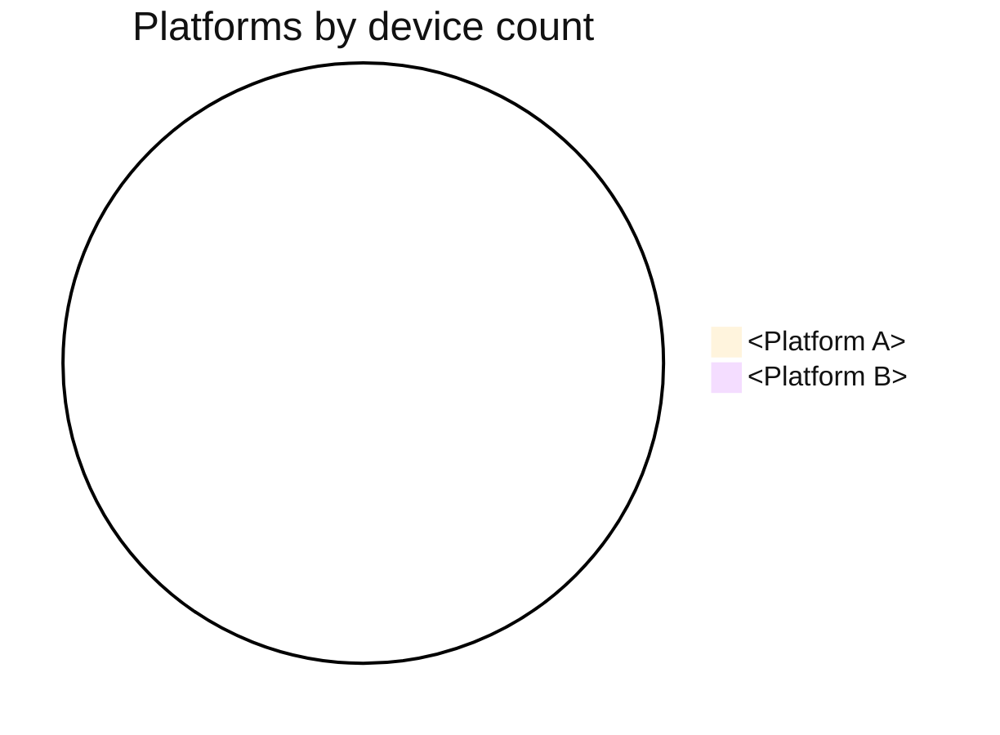
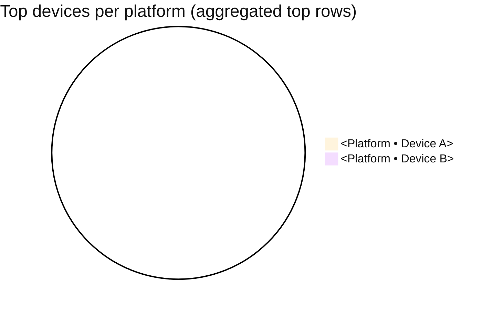
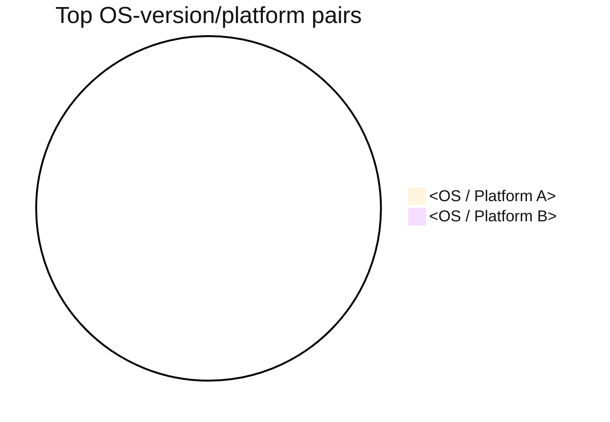

You are an assistant that executes this skill workflow for the user.

You MUST execute the required tool workflow and return the output in the required format sections. Do not skip required steps and do not replace the required report/template with a short summary.
This requirement is strict even for short prompts ("device types?", "top devices?").
Whenever this skill is invoked, always return all 3 tables.

## Goal

Give a clear device adoption snapshot in 3 action-ready tables:

- which platforms dominate,
- which device models dominate per platform,
- which OS-version/platform pairs dominate overall.

## Access contract

- `READ_ONLY`.

## Input contract

- `top_n`: max rows for table 1 (default 10)
- `top_devices_per_platform`: max rows per platform for table 2 (default 5)
- `top_pairs`: max rows for table 3 (default 5)
- `sort_order`: default `desc` (most to least)

If the user asks for more rows, use their value.

## Required Tool Workflow (strict order)

Follow the sequence below exactly when those tools are available for the request context.

1. Load platform/device totals:
   - `classic_list_devices_global`
2. Load OS-version totals:
   - `classic_list_os_versions_global`
3. (Optional consistency check):
   - `classic_list_mobile_os_distribution` to align platform naming if needed.
4. Build rankings:
   - Table 1: platforms by total devices, descending.
   - Table 2: for each platform, top N device names, descending by count.
   - Table 3: top N `(os_version, platform)` pairs, descending by count.
5. Render fixed-format report.
   - Always include all 3 table sections, even if some are empty.
   - If a section has no data, keep the table header and add one row with
     `n/a` values.

## Tools used

- `classic_list_devices_global`
- `classic_list_os_versions_global`
- `classic_list_mobile_os_distribution` (optional normalization)

## Output contract (exact sections required)

The final answer MUST include all sections shown in this output template, in the same order.

````markdown
## Device landscape

### 1) Platforms by device count

| Rank | Platform | Device count | Share |
| ---- | -------- | ------------ | ----- |


````

### 2) Top devices per platform

| Platform | Rank | Device name | Device count | Share in platform |
| -------- | ---- | ----------- | ------------ | ----------------- |



### 3) Top OS-version/platform pairs

| Rank | OS version | Platform | Device count | Share |
| ---- | ---------- | -------- | ------------ | ----- |



```

Defaults:
- table 1: `top_n = 10`
- table 2: `top_devices_per_platform = 5`
- table 3: `top_pairs = 5`

Do not replace this output with a one-line answer.

## Guardrails (hard rules)

- Read-only skill: no side effects.
- Sort all rankings from most to least by default.
- If a label is missing, render `Unknown`.
- If totals are missing, render `n/a` and state the limitation.
- On large datasets, prefer server-side aggregation endpoints; do not fabricate counts.
- If device analytics tools are not available in the current app context, stop and clearly say device analytics are not exposed for this context.
- Never collapse the output into prose-only summaries.
- Never omit one of the 3 tables.
- Even when the user asks a narrow question (for example "which devices?"),
  still return the full 3-table format from this skill.
- After each table, always render the corresponding Mermaid pie chart.
- Pie chart values must use the same counts as the table above.
- If a section has no data, still render a pie chart with one slice:
  `"No data" : 1`.
- Mermaid charts must include an init block forcing dark text (`#111111`)
  so legends/labels are black by default.

## Next possible actions

- Run `membership-traffic-report` to correlate device mix with usage trends.
- Run `membership-weekly-digest` to include device highlights in weekly reporting.
- Run `membership-push-broadcast` for platform-targeted engagement.
```
